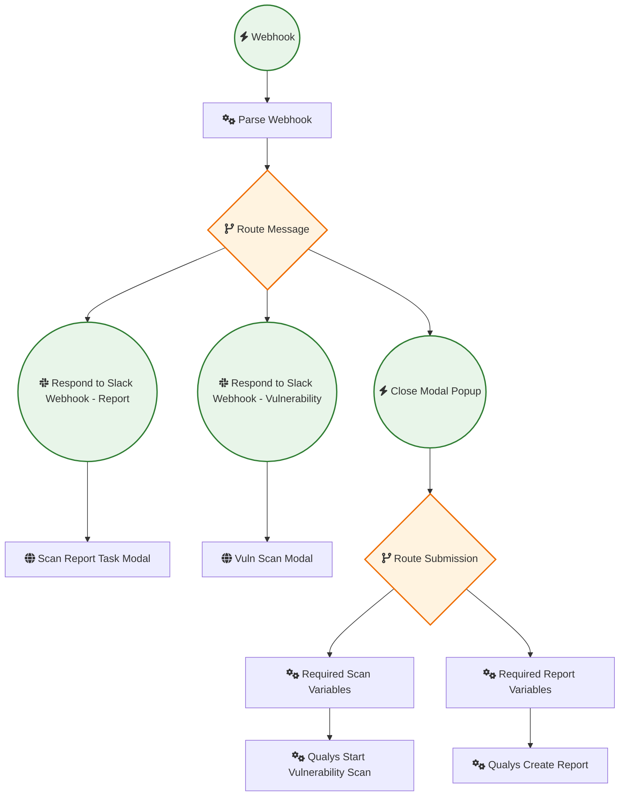

```mermaid
graph TD
    classDef trigger fill:#e8f5e9,stroke:#2e7d32,stroke-width:2px;
    classDef ai fill:#e3f2fd,stroke:#1565c0,stroke-width:2px;
    classDef logic fill:#fff3e0,stroke:#ef6c00,stroke-width:2px;

    Parse_Webhook["fas:fa-cogs Parse Webhook"]
    Qualys_Create_Report["fas:fa-cogs Qualys Create Report"]
    Required_Report_Variables["fas:fa-cogs Required Report Variables"]
    Qualys_Start_Vulnerability_Scan["fas:fa-cogs Qualys Start Vulnerability Scan"]
    Scan_Report_Task_Modal["fas:fa-globe Scan Report Task Modal"]
    Vuln_Scan_Modal["fas:fa-globe Vuln Scan Modal"]
    Route_Message{"fas:fa-code-branch Route Message"}:::logic
    Required_Scan_Variables["fas:fa-cogs Required Scan Variables"]
    Route_Submission{"fas:fa-code-branch Route Submission"}:::logic
    Close_Modal_Popup(("fas:fa-bolt Close Modal Popup")):::trigger
    Webhook(("fas:fa-bolt Webhook")):::trigger
    Respond_to_Slack_Webhook___Vulnerability(("fab:fa-slack Respond to Slack Webhook - Vulnerability")):::trigger
    Respond_to_Slack_Webhook___Report(("fab:fa-slack Respond to Slack Webhook - Report")):::trigger

    Webhook --> Parse_Webhook
    Parse_Webhook --> Route_Message
    Route_Message --> Respond_to_Slack_Webhook___Vulnerability
    Route_Message --> Respond_to_Slack_Webhook___Report
    Route_Message --> Close_Modal_Popup
    Route_Submission --> Required_Scan_Variables
    Route_Submission --> Required_Report_Variables
    Close_Modal_Popup --> Route_Submission
    Required_Scan_Variables --> Qualys_Start_Vulnerability_Scan
    Required_Report_Variables --> Qualys_Create_Report
    Respond_to_Slack_Webhook___Report --> Scan_Report_Task_Modal
    Respond_to_Slack_Webhook___Vulnerability --> Vuln_Scan_Modal
```
