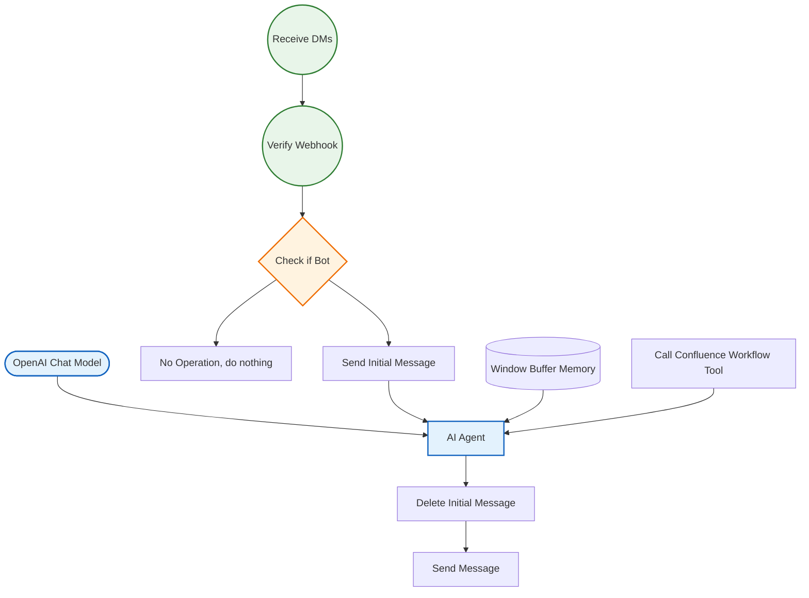

```mermaid
graph TD
    classDef trigger fill:#e8f5e9,stroke:#2e7d32,stroke-width:2px;
    classDef ai fill:#e3f2fd,stroke:#1565c0,stroke-width:2px;
    classDef logic fill:#fff3e0,stroke:#ef6c00,stroke-width:2px;

    Verify_Webhook(("Verify Webhook")):::trigger
    OpenAI_Chat_Model(["OpenAI Chat Model"]):::ai
    No_Operation__do_nothing["No Operation, do nothing"]
    Window_Buffer_Memory[("Window Buffer Memory")]
    Check_if_Bot{"Check if Bot"}:::logic
    Send_Initial_Message["Send Initial Message"]
    Delete_Initial_Message["Delete Initial Message"]
    Send_Message["Send Message"]
    Receive_DMs(("Receive DMs")):::trigger
    Call_Confluence_Workflow_Tool["Call Confluence Workflow Tool"]
    AI_Agent["AI Agent"]:::ai

    AI_Agent --> Delete_Initial_Message
    Receive_DMs --> Verify_Webhook
    Check_if_Bot --> No_Operation__do_nothing
    Check_if_Bot --> Send_Initial_Message
    Verify_Webhook --> Check_if_Bot
    OpenAI_Chat_Model --> AI_Agent
    Send_Initial_Message --> AI_Agent
    Window_Buffer_Memory --> AI_Agent
    Delete_Initial_Message --> Send_Message
    Call_Confluence_Workflow_Tool --> AI_Agent
```
