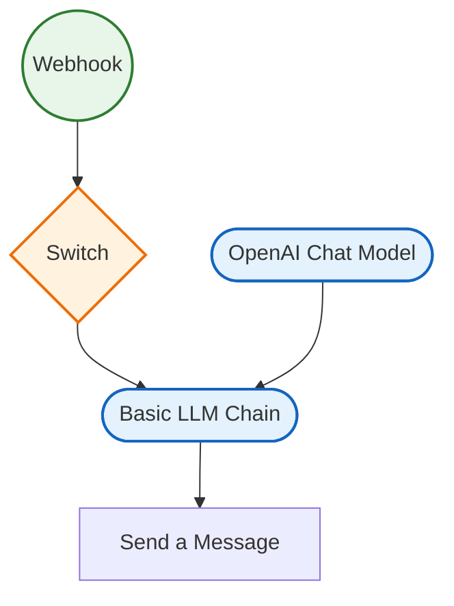

```mermaid
graph TD
    classDef trigger fill:#e8f5e9,stroke:#2e7d32,stroke-width:2px;
    classDef ai fill:#e3f2fd,stroke:#1565c0,stroke-width:2px;
    classDef logic fill:#fff3e0,stroke:#ef6c00,stroke-width:2px;

    Webhook(("Webhook")):::trigger
    Switch{"Switch"}:::logic
    Basic_LLM_Chain(["Basic LLM Chain"]):::ai
    OpenAI_Chat_Model(["OpenAI Chat Model"]):::ai
    Send_a_Message["Send a Message"]

    Switch --> Basic_LLM_Chain
    Webhook --> Switch
    Basic_LLM_Chain --> Send_a_Message
    OpenAI_Chat_Model --> Basic_LLM_Chain
```
