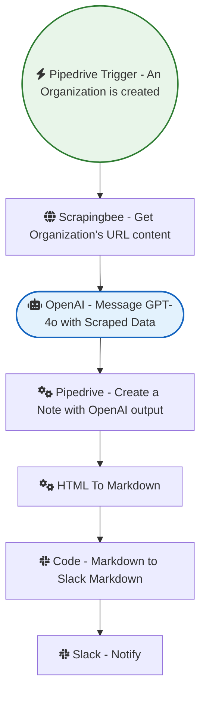

```mermaid
graph TD
    classDef trigger fill:#e8f5e9,stroke:#2e7d32,stroke-width:2px;
    classDef ai fill:#e3f2fd,stroke:#1565c0,stroke-width:2px;
    classDef logic fill:#fff3e0,stroke:#ef6c00,stroke-width:2px;

    Pipedrive_Trigger___An_Organization_is_created(("fas:fa-bolt Pipedrive Trigger - An Organization is created")):::trigger
    Pipedrive___Create_a_Note_with_OpenAI_output["fas:fa-cogs Pipedrive - Create a Note with OpenAI output"]
    Code___Markdown_to_Slack_Markdown["fab:fa-slack Code - Markdown to Slack Markdown"]
    Scrapingbee___Get_Organization_s_URL_content["fas:fa-globe Scrapingbee - Get Organization's URL content"]
    HTML_To_Markdown["fas:fa-cogs HTML To Markdown"]
    Slack___Notify_["fab:fa-slack Slack - Notify "]
    OpenAI___Message_GPT_4o_with_Scraped_Data(["fas:fa-robot OpenAI - Message GPT-4o with Scraped Data"]):::ai

    HTML_To_Markdown --> Code___Markdown_to_Slack_Markdown
    Code___Markdown_to_Slack_Markdown --> Slack___Notify_
    OpenAI___Message_GPT_4o_with_Scraped_Data --> Pipedrive___Create_a_Note_with_OpenAI_output
    Pipedrive___Create_a_Note_with_OpenAI_output --> HTML_To_Markdown
    Scrapingbee___Get_Organization_s_URL_content --> OpenAI___Message_GPT_4o_with_Scraped_Data
    Pipedrive_Trigger___An_Organization_is_created --> Scrapingbee___Get_Organization_s_URL_content
```
