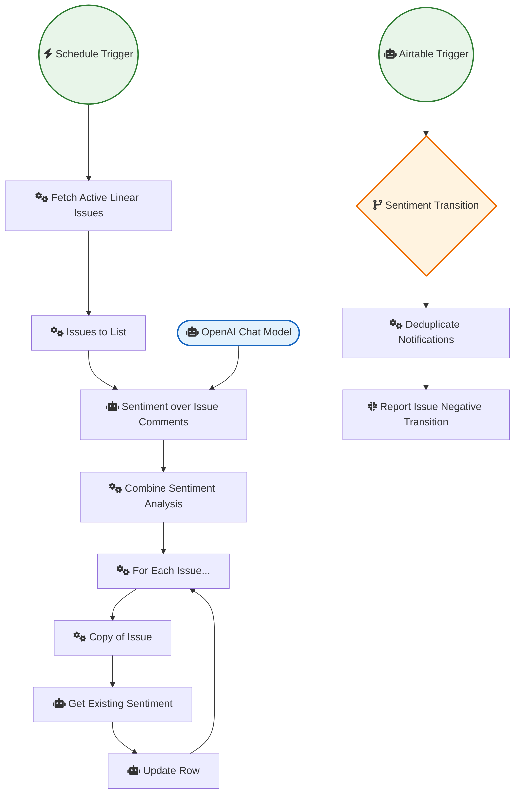

```mermaid
graph TD
    classDef trigger fill:#e8f5e9,stroke:#2e7d32,stroke-width:2px;
    classDef ai fill:#e3f2fd,stroke:#1565c0,stroke-width:2px;
    classDef logic fill:#fff3e0,stroke:#ef6c00,stroke-width:2px;

    Issues_to_List["fas:fa-cogs Issues to List"]
    OpenAI_Chat_Model(["fas:fa-robot OpenAI Chat Model"]):::ai
    Combine_Sentiment_Analysis["fas:fa-cogs Combine Sentiment Analysis"]
    Sentiment_over_Issue_Comments["fas:fa-robot Sentiment over Issue Comments"]
    Copy_of_Issue["fas:fa-cogs Copy of Issue"]
    For_Each_Issue___["fas:fa-cogs For Each Issue..."]
    Get_Existing_Sentiment["fas:fa-robot Get Existing Sentiment"]
    Update_Row["fas:fa-robot Update Row"]
    Airtable_Trigger(("fas:fa-robot Airtable Trigger")):::trigger
    Sentiment_Transition{"fas:fa-code-branch Sentiment Transition"}:::logic
    Fetch_Active_Linear_Issues["fas:fa-cogs Fetch Active Linear Issues"]
    Schedule_Trigger(("fas:fa-bolt Schedule Trigger")):::trigger
    Deduplicate_Notifications["fas:fa-cogs Deduplicate Notifications"]
    Report_Issue_Negative_Transition["fab:fa-slack Report Issue Negative Transition"]

    Update_Row --> For_Each_Issue___
    Copy_of_Issue --> Get_Existing_Sentiment
    Issues_to_List --> Sentiment_over_Issue_Comments
    Airtable_Trigger --> Sentiment_Transition
    Schedule_Trigger --> Fetch_Active_Linear_Issues
    For_Each_Issue___ --> Copy_of_Issue
    OpenAI_Chat_Model --> Sentiment_over_Issue_Comments
    Sentiment_Transition --> Deduplicate_Notifications
    Get_Existing_Sentiment --> Update_Row
    Deduplicate_Notifications --> Report_Issue_Negative_Transition
    Combine_Sentiment_Analysis --> For_Each_Issue___
    Fetch_Active_Linear_Issues --> Issues_to_List
    Sentiment_over_Issue_Comments --> Combine_Sentiment_Analysis
```
