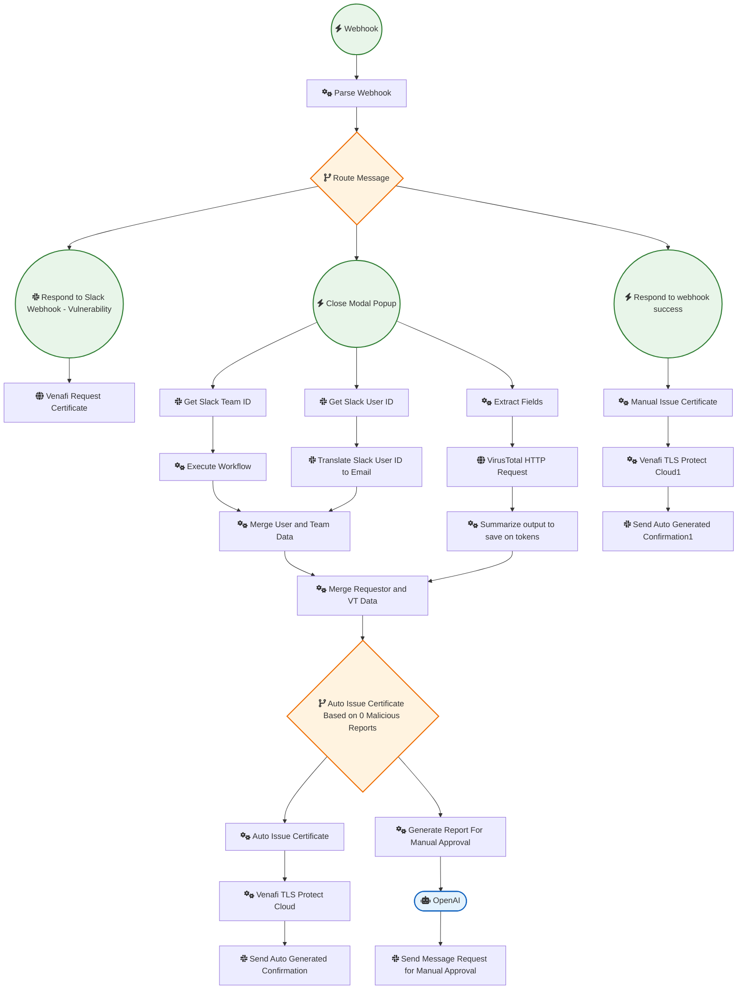

```mermaid
graph TD
    classDef trigger fill:#e8f5e9,stroke:#2e7d32,stroke-width:2px;
    classDef ai fill:#e3f2fd,stroke:#1565c0,stroke-width:2px;
    classDef logic fill:#fff3e0,stroke:#ef6c00,stroke-width:2px;

    Venafi_TLS_Protect_Cloud["fas:fa-cogs Venafi TLS Protect Cloud"]
    Parse_Webhook["fas:fa-cogs Parse Webhook"]
    Close_Modal_Popup(("fas:fa-bolt Close Modal Popup")):::trigger
    Respond_to_Slack_Webhook___Vulnerability(("fab:fa-slack Respond to Slack Webhook - Vulnerability")):::trigger
    Venafi_Request_Certificate["fas:fa-globe Venafi Request Certificate"]
    Extract_Fields["fas:fa-cogs Extract Fields"]
    Get_Slack_User_ID["fab:fa-slack Get Slack User ID"]
    Translate_Slack_User_ID_to_Email["fab:fa-slack Translate Slack User ID to Email"]
    VirusTotal_HTTP_Request["fas:fa-globe VirusTotal HTTP Request"]
    Summarize_output_to_save_on_tokens["fas:fa-cogs Summarize output to save on tokens"]
    Auto_Issue_Certificate_Based_on_0_Malicious_Reports{"fas:fa-code-branch Auto Issue Certificate Based on 0 Malicious Reports"}:::logic
    Auto_Issue_Certificate["fas:fa-cogs Auto Issue Certificate"]
    Generate_Report_For_Manual_Approval["fas:fa-cogs Generate Report For Manual Approval"]
    Get_Slack_Team_ID["fab:fa-slack Get Slack Team ID"]
    Execute_Workflow["fas:fa-cogs Execute Workflow"]
    Merge_User_and_Team_Data["fas:fa-cogs Merge User and Team Data"]
    OpenAI(["fas:fa-robot OpenAI"]):::ai
    Merge_Requestor_and_VT_Data["fas:fa-cogs Merge Requestor and VT Data"]
    Send_Auto_Generated_Confirmation["fab:fa-slack Send Auto Generated Confirmation"]
    Send_Message_Request_for_Manual_Approval["fab:fa-slack Send Message Request for Manual Approval"]
    Route_Message{"fas:fa-code-branch Route Message"}:::logic
    Venafi_TLS_Protect_Cloud1["fas:fa-cogs Venafi TLS Protect Cloud1"]
    Send_Auto_Generated_Confirmation1["fab:fa-slack Send Auto Generated Confirmation1"]
    Manual_Issue_Certificate["fas:fa-cogs Manual Issue Certificate"]
    Webhook(("fas:fa-bolt Webhook")):::trigger
    Respond_to_webhook_success(("fas:fa-bolt Respond to webhook success")):::trigger

    OpenAI --> Send_Message_Request_for_Manual_Approval
    Webhook --> Parse_Webhook
    Parse_Webhook --> Route_Message
    Route_Message --> Respond_to_Slack_Webhook___Vulnerability
    Route_Message --> Close_Modal_Popup
    Route_Message --> Respond_to_webhook_success
    Extract_Fields --> VirusTotal_HTTP_Request
    Execute_Workflow --> Merge_User_and_Team_Data
    Close_Modal_Popup --> Extract_Fields
    Close_Modal_Popup --> Get_Slack_User_ID
    Close_Modal_Popup --> Get_Slack_Team_ID
    Get_Slack_Team_ID --> Execute_Workflow
    Get_Slack_User_ID --> Translate_Slack_User_ID_to_Email
    Auto_Issue_Certificate --> Venafi_TLS_Protect_Cloud
    VirusTotal_HTTP_Request --> Summarize_output_to_save_on_tokens
    Manual_Issue_Certificate --> Venafi_TLS_Protect_Cloud1
    Merge_User_and_Team_Data --> Merge_Requestor_and_VT_Data
    Venafi_TLS_Protect_Cloud --> Send_Auto_Generated_Confirmation
    Venafi_TLS_Protect_Cloud1 --> Send_Auto_Generated_Confirmation1
    Respond_to_webhook_success --> Manual_Issue_Certificate
    Merge_Requestor_and_VT_Data --> Auto_Issue_Certificate_Based_on_0_Malicious_Reports
    Translate_Slack_User_ID_to_Email --> Merge_User_and_Team_Data
    Summarize_output_to_save_on_tokens --> Merge_Requestor_and_VT_Data
    Generate_Report_For_Manual_Approval --> OpenAI
    Respond_to_Slack_Webhook___Vulnerability --> Venafi_Request_Certificate
    Auto_Issue_Certificate_Based_on_0_Malicious_Reports --> Auto_Issue_Certificate
    Auto_Issue_Certificate_Based_on_0_Malicious_Reports --> Generate_Report_For_Manual_Approval
```
