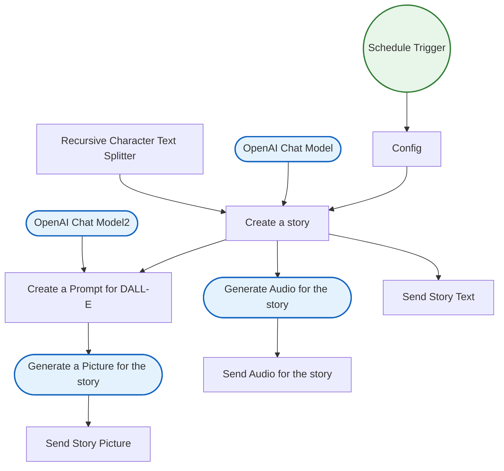

```mermaid
graph TD
    classDef trigger fill:#e8f5e9,stroke:#2e7d32,stroke-width:2px;
    classDef ai fill:#e3f2fd,stroke:#1565c0,stroke-width:2px;
    classDef logic fill:#fff3e0,stroke:#ef6c00,stroke-width:2px;

    OpenAI_Chat_Model(["OpenAI Chat Model"]):::ai
    Schedule_Trigger(("Schedule Trigger")):::trigger
    OpenAI_Chat_Model2(["OpenAI Chat Model2"]):::ai
    Create_a_Prompt_for_DALL_E["Create a Prompt for DALL-E"]
    Recursive_Character_Text_Splitter["Recursive Character Text Splitter"]
    Create_a_story["Create a story"]
    Generate_Audio_for_the_story(["Generate Audio for the story"]):::ai
    Generate_a_Picture_for_the_story(["Generate a Picture for the story"]):::ai
    Send_Story_Text["Send Story Text"]
    Send_Audio_for_the_story["Send Audio for the story"]
    Send_Story_Picture["Send Story Picture"]
    Config["Config"]

    Config --> Create_a_story
    Create_a_story --> Generate_Audio_for_the_story
    Create_a_story --> Create_a_Prompt_for_DALL_E
    Create_a_story --> Send_Story_Text
    Schedule_Trigger --> Config
    OpenAI_Chat_Model --> Create_a_story
    OpenAI_Chat_Model2 --> Create_a_Prompt_for_DALL_E
    Create_a_Prompt_for_DALL_E --> Generate_a_Picture_for_the_story
    Generate_Audio_for_the_story --> Send_Audio_for_the_story
    Generate_a_Picture_for_the_story --> Send_Story_Picture
    Recursive_Character_Text_Splitter --> Create_a_story
```
