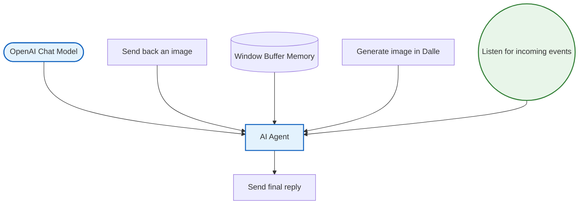

```mermaid
graph TD
    classDef trigger fill:#e8f5e9,stroke:#2e7d32,stroke-width:2px;
    classDef ai fill:#e3f2fd,stroke:#1565c0,stroke-width:2px;
    classDef logic fill:#fff3e0,stroke:#ef6c00,stroke-width:2px;

    OpenAI_Chat_Model(["OpenAI Chat Model"]):::ai
    Window_Buffer_Memory[("Window Buffer Memory")]
    Listen_for_incoming_events(("Listen for incoming events")):::trigger
    Send_final_reply["Send final reply"]
    Send_back_an_image["Send back an image"]
    Generate_image_in_Dalle["Generate image in Dalle"]
    AI_Agent["AI Agent"]:::ai

    AI_Agent --> Send_final_reply
    OpenAI_Chat_Model --> AI_Agent
    Send_back_an_image --> AI_Agent
    Window_Buffer_Memory --> AI_Agent
    Generate_image_in_Dalle --> AI_Agent
    Listen_for_incoming_events --> AI_Agent
```
