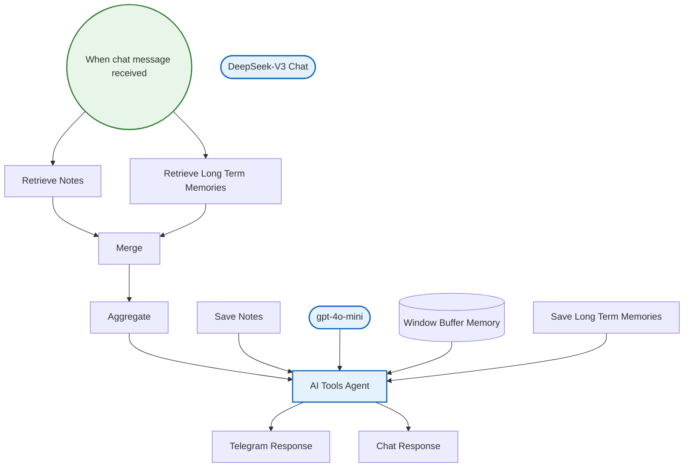

```mermaid
graph TD
    classDef trigger fill:#e8f5e9,stroke:#2e7d32,stroke-width:2px;
    classDef ai fill:#e3f2fd,stroke:#1565c0,stroke-width:2px;
    classDef logic fill:#fff3e0,stroke:#ef6c00,stroke-width:2px;

    When_chat_message_received(("When chat message received")):::trigger
    gpt_4o_mini(["gpt-4o-mini"]):::ai
    Chat_Response["Chat Response"]
    Window_Buffer_Memory[("Window Buffer Memory")]
    Save_Long_Term_Memories["Save Long Term Memories"]
    Retrieve_Long_Term_Memories["Retrieve Long Term Memories"]
    Telegram_Response["Telegram Response"]
    DeepSeek_V3_Chat(["DeepSeek-V3 Chat"]):::ai
    AI_Tools_Agent["AI Tools Agent"]:::ai
    Save_Notes["Save Notes"]
    Retrieve_Notes["Retrieve Notes"]
    Aggregate["Aggregate"]
    Merge["Merge"]

    Merge --> Aggregate
    Aggregate --> AI_Tools_Agent
    Save_Notes --> AI_Tools_Agent
    gpt_4o_mini --> AI_Tools_Agent
    AI_Tools_Agent --> Telegram_Response
    AI_Tools_Agent --> Chat_Response
    Retrieve_Notes --> Merge
    Window_Buffer_Memory --> AI_Tools_Agent
    Save_Long_Term_Memories --> AI_Tools_Agent
    When_chat_message_received --> Retrieve_Long_Term_Memories
    When_chat_message_received --> Retrieve_Notes
    Retrieve_Long_Term_Memories --> Merge
```
