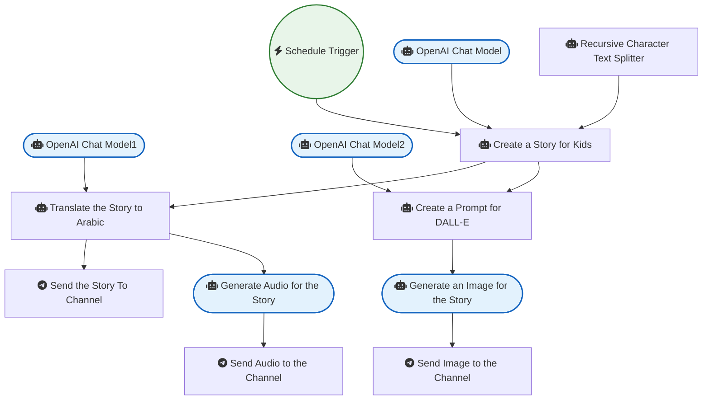

```mermaid
graph TD
    classDef trigger fill:#e8f5e9,stroke:#2e7d32,stroke-width:2px;
    classDef ai fill:#e3f2fd,stroke:#1565c0,stroke-width:2px;
    classDef logic fill:#fff3e0,stroke:#ef6c00,stroke-width:2px;

    OpenAI_Chat_Model(["fas:fa-robot OpenAI Chat Model"]):::ai
    OpenAI_Chat_Model1(["fas:fa-robot OpenAI Chat Model1"]):::ai
    Schedule_Trigger(("fas:fa-bolt Schedule Trigger")):::trigger
    Recursive_Character_Text_Splitter["fas:fa-robot Recursive Character Text Splitter"]
    OpenAI_Chat_Model2(["fas:fa-robot OpenAI Chat Model2"]):::ai
    Create_a_Prompt_for_DALL_E["fas:fa-robot Create a Prompt for DALL-E"]
    Generate_an_Image_for_the_Story(["fas:fa-robot Generate an Image for the Story"]):::ai
    Generate_Audio_for_the_Story(["fas:fa-robot Generate Audio for the Story"]):::ai
    Send_the_Story_To_Channel["fab:fa-telegram Send the Story To Channel"]
    Send_Image_to_the_Channel["fab:fa-telegram Send Image to the Channel"]
    Translate_the_Story_to_Arabic["fas:fa-robot Translate the Story to Arabic"]
    Send_Audio_to_the_Channel["fab:fa-telegram Send Audio to the Channel"]
    Create_a_Story_for_Kids["fas:fa-robot Create a Story for Kids"]

    Schedule_Trigger --> Create_a_Story_for_Kids
    OpenAI_Chat_Model --> Create_a_Story_for_Kids
    OpenAI_Chat_Model1 --> Translate_the_Story_to_Arabic
    OpenAI_Chat_Model2 --> Create_a_Prompt_for_DALL_E
    Create_a_Story_for_Kids --> Translate_the_Story_to_Arabic
    Create_a_Story_for_Kids --> Create_a_Prompt_for_DALL_E
    Create_a_Prompt_for_DALL_E --> Generate_an_Image_for_the_Story
    Generate_Audio_for_the_Story --> Send_Audio_to_the_Channel
    Translate_the_Story_to_Arabic --> Send_the_Story_To_Channel
    Translate_the_Story_to_Arabic --> Generate_Audio_for_the_Story
    Generate_an_Image_for_the_Story --> Send_Image_to_the_Channel
    Recursive_Character_Text_Splitter --> Create_a_Story_for_Kids
```
