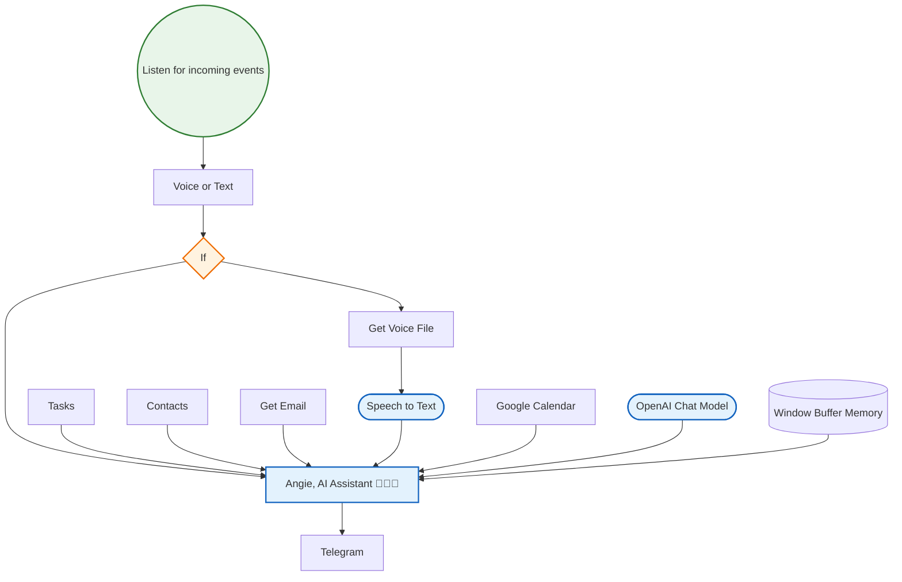

```mermaid
graph TD
    classDef trigger fill:#e8f5e9,stroke:#2e7d32,stroke-width:2px;
    classDef ai fill:#e3f2fd,stroke:#1565c0,stroke-width:2px;
    classDef logic fill:#fff3e0,stroke:#ef6c00,stroke-width:2px;

    Google_Calendar["Google Calendar"]
    Window_Buffer_Memory[("Window Buffer Memory")]
    Get_Email["Get Email"]
    OpenAI_Chat_Model(["OpenAI Chat Model"]):::ai
    Listen_for_incoming_events(("Listen for incoming events")):::trigger
    Telegram["Telegram"]
    If{"If"}:::logic
    Speech_to_Text(["Speech to Text"]):::ai
    Voice_or_Text["Voice or Text"]
    Get_Voice_File["Get Voice File"]
    Angie__AI_Assistant_____["Angie, AI Assistant 👩🏻‍🏫"]:::ai
    Tasks["Tasks"]
    Contacts["Contacts"]

    If --> Get_Voice_File
    If --> Angie__AI_Assistant_____
    Tasks --> Angie__AI_Assistant_____
    Contacts --> Angie__AI_Assistant_____
    Get_Email --> Angie__AI_Assistant_____
    Voice_or_Text --> If
    Get_Voice_File --> Speech_to_Text
    Speech_to_Text --> Angie__AI_Assistant_____
    Google_Calendar --> Angie__AI_Assistant_____
    OpenAI_Chat_Model --> Angie__AI_Assistant_____
    Window_Buffer_Memory --> Angie__AI_Assistant_____
    Listen_for_incoming_events --> Voice_or_Text
    Angie__AI_Assistant_____ --> Telegram
```
