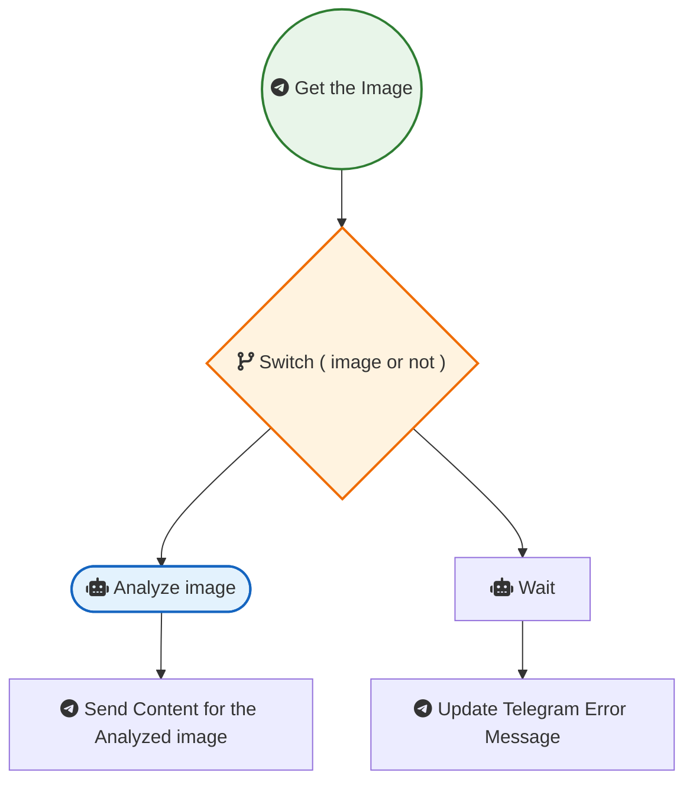

```mermaid
graph TD
    classDef trigger fill:#e8f5e9,stroke:#2e7d32,stroke-width:2px;
    classDef ai fill:#e3f2fd,stroke:#1565c0,stroke-width:2px;
    classDef logic fill:#fff3e0,stroke:#ef6c00,stroke-width:2px;

    Get_the_Image(("fab:fa-telegram Get the Image")):::trigger
    Send_Content_for_the_Analyzed_image["fab:fa-telegram Send Content for the Analyzed image"]
    Update_Telegram_Error_Message["fab:fa-telegram Update Telegram Error Message"]
    Wait["fas:fa-robot Wait"]
    Analyze_image(["fas:fa-robot Analyze image"]):::ai
    Switch___image_or_not__{"fas:fa-code-branch Switch ( image or not )"}:::logic

    Wait --> Update_Telegram_Error_Message
    Analyze_image --> Send_Content_for_the_Analyzed_image
    Get_the_Image --> Switch___image_or_not__
    Switch___image_or_not__ --> Analyze_image
    Switch___image_or_not__ --> Wait
```
