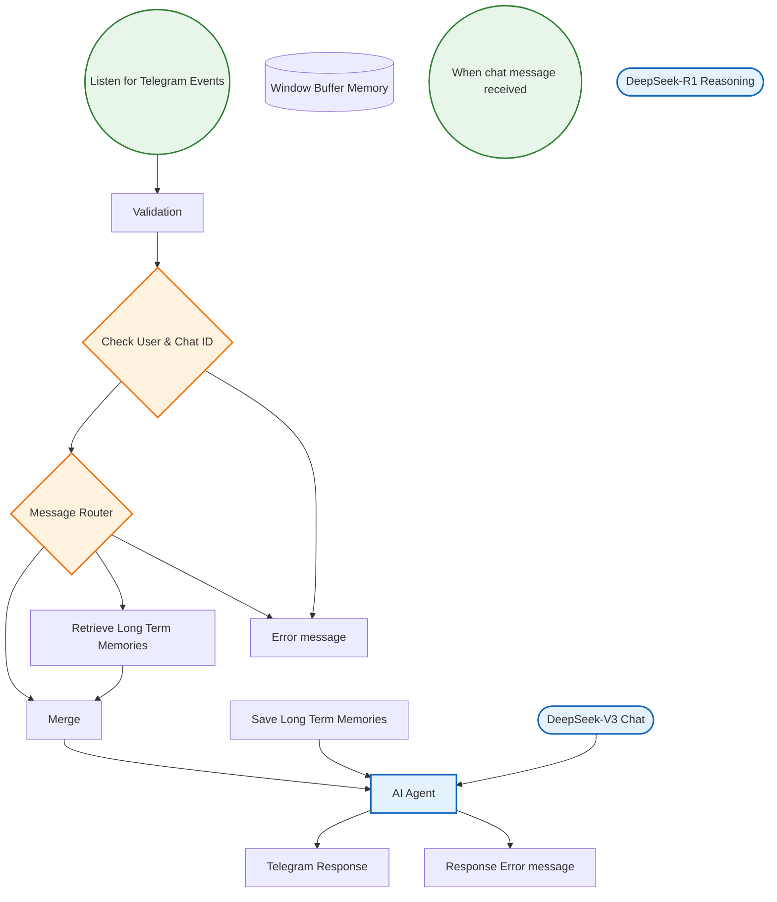

```mermaid
graph TD
    classDef trigger fill:#e8f5e9,stroke:#2e7d32,stroke-width:2px;
    classDef ai fill:#e3f2fd,stroke:#1565c0,stroke-width:2px;
    classDef logic fill:#fff3e0,stroke:#ef6c00,stroke-width:2px;

    Check_User___Chat_ID{"Check User & Chat ID"}:::logic
    Error_message["Error message"]
    Listen_for_Telegram_Events(("Listen for Telegram Events")):::trigger
    Validation["Validation"]
    Message_Router{"Message Router"}:::logic
    AI_Agent["AI Agent"]:::ai
    Merge["Merge"]
    Window_Buffer_Memory[("Window Buffer Memory")]
    When_chat_message_received(("When chat message received")):::trigger
    Telegram_Response["Telegram Response"]
    Save_Long_Term_Memories["Save Long Term Memories"]
    Retrieve_Long_Term_Memories["Retrieve Long Term Memories"]
    Response_Error_message["Response Error message"]
    DeepSeek_R1_Reasoning(["DeepSeek-R1 Reasoning"]):::ai
    DeepSeek_V3_Chat(["DeepSeek-V3 Chat"]):::ai

    Merge --> AI_Agent
    AI_Agent --> Telegram_Response
    AI_Agent --> Response_Error_message
    Validation --> Check_User___Chat_ID
    Message_Router --> Merge
    Message_Router --> Retrieve_Long_Term_Memories
    Message_Router --> Error_message
    DeepSeek_V3_Chat --> AI_Agent
    Check_User___Chat_ID --> Message_Router
    Check_User___Chat_ID --> Error_message
    Save_Long_Term_Memories --> AI_Agent
    Listen_for_Telegram_Events --> Validation
    Retrieve_Long_Term_Memories --> Merge
```
