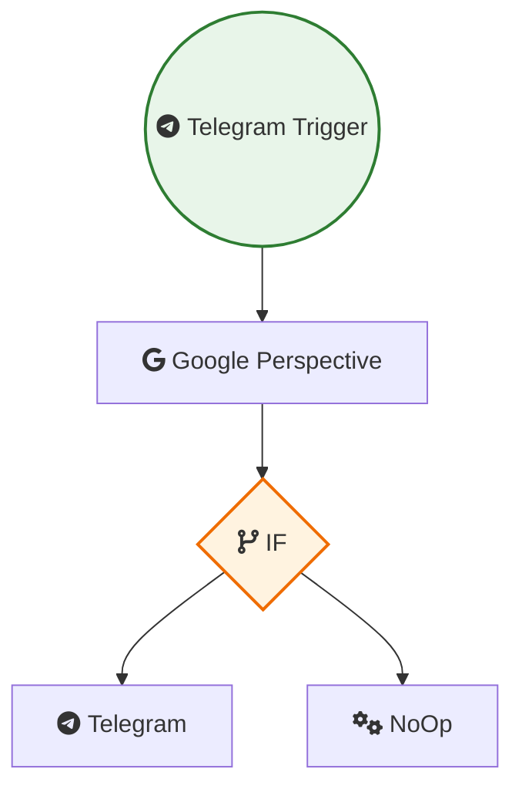

```mermaid
graph TD
    classDef trigger fill:#e8f5e9,stroke:#2e7d32,stroke-width:2px;
    classDef ai fill:#e3f2fd,stroke:#1565c0,stroke-width:2px;
    classDef logic fill:#fff3e0,stroke:#ef6c00,stroke-width:2px;

    Telegram_Trigger(("fab:fa-telegram Telegram Trigger")):::trigger
    Google_Perspective["fab:fa-google Google Perspective"]
    IF{"fas:fa-code-branch IF"}:::logic
    Telegram["fab:fa-telegram Telegram"]
    NoOp["fas:fa-cogs NoOp"]

    IF --> Telegram
    IF --> NoOp
    Telegram_Trigger --> Google_Perspective
    Google_Perspective --> IF
```
