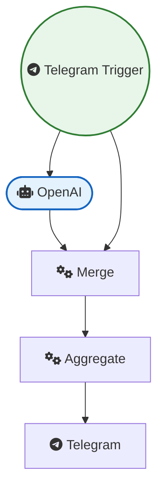

```mermaid
graph TD
    classDef trigger fill:#e8f5e9,stroke:#2e7d32,stroke-width:2px;
    classDef ai fill:#e3f2fd,stroke:#1565c0,stroke-width:2px;
    classDef logic fill:#fff3e0,stroke:#ef6c00,stroke-width:2px;

    Telegram_Trigger(("fab:fa-telegram Telegram Trigger")):::trigger
    OpenAI(["fas:fa-robot OpenAI"]):::ai
    Telegram["fab:fa-telegram Telegram"]
    Merge["fas:fa-cogs Merge"]
    Aggregate["fas:fa-cogs Aggregate"]

    Merge --> Aggregate
    OpenAI --> Merge
    Aggregate --> Telegram
    Telegram_Trigger --> OpenAI
    Telegram_Trigger --> Merge
```
