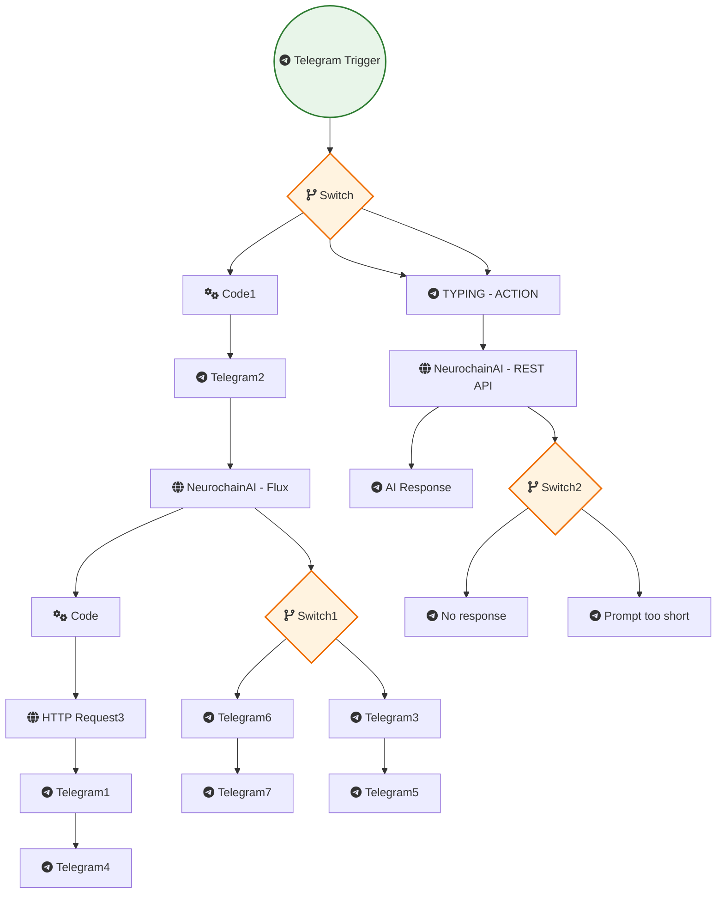

```mermaid
graph TD
    classDef trigger fill:#e8f5e9,stroke:#2e7d32,stroke-width:2px;
    classDef ai fill:#e3f2fd,stroke:#1565c0,stroke-width:2px;
    classDef logic fill:#fff3e0,stroke:#ef6c00,stroke-width:2px;

    Telegram_Trigger(("fab:fa-telegram Telegram Trigger")):::trigger
    Code["fas:fa-cogs Code"]
    HTTP_Request3["fas:fa-globe HTTP Request3"]
    Telegram2["fab:fa-telegram Telegram2"]
    Telegram1["fab:fa-telegram Telegram1"]
    Telegram4["fab:fa-telegram Telegram4"]
    Telegram3["fab:fa-telegram Telegram3"]
    Telegram5["fab:fa-telegram Telegram5"]
    Telegram6["fab:fa-telegram Telegram6"]
    Telegram7["fab:fa-telegram Telegram7"]
    NeurochainAI___REST_API["fas:fa-globe NeurochainAI - REST API"]
    TYPING___ACTION["fab:fa-telegram TYPING - ACTION"]
    AI_Response["fab:fa-telegram AI Response"]
    No_response["fab:fa-telegram No response"]
    Prompt_too_short["fab:fa-telegram Prompt too short"]
    Switch2{"fas:fa-code-branch Switch2"}:::logic
    Code1["fas:fa-cogs Code1"]
    Switch{"fas:fa-code-branch Switch"}:::logic
    NeurochainAI___Flux["fas:fa-globe NeurochainAI - Flux"]
    Switch1{"fas:fa-code-branch Switch1"}:::logic

    Code --> HTTP_Request3
    Code1 --> Telegram2
    Switch --> Code1
    Switch --> TYPING___ACTION
    Switch --> TYPING___ACTION
    Switch1 --> Telegram6
    Switch1 --> Telegram3
    Switch2 --> No_response
    Switch2 --> Prompt_too_short
    Telegram1 --> Telegram4
    Telegram2 --> NeurochainAI___Flux
    Telegram3 --> Telegram5
    Telegram6 --> Telegram7
    HTTP_Request3 --> Telegram1
    TYPING___ACTION --> NeurochainAI___REST_API
    Telegram_Trigger --> Switch
    NeurochainAI___Flux --> Code
    NeurochainAI___Flux --> Switch1
    NeurochainAI___REST_API --> AI_Response
    NeurochainAI___REST_API --> Switch2
```
