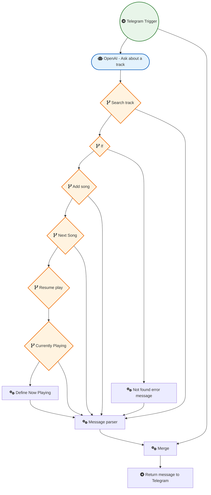

```mermaid
graph TD
    classDef trigger fill:#e8f5e9,stroke:#2e7d32,stroke-width:2px;
    classDef ai fill:#e3f2fd,stroke:#1565c0,stroke-width:2px;
    classDef logic fill:#fff3e0,stroke:#ef6c00,stroke-width:2px;

    Telegram_Trigger(("fab:fa-telegram Telegram Trigger")):::trigger
    OpenAI___Ask_about_a_track(["fas:fa-robot OpenAI - Ask about a track"]):::ai
    Search_track{"fas:fa-code-branch Search track"}:::logic
    Add_song{"fas:fa-code-branch Add song"}:::logic
    Next_Song{"fas:fa-code-branch Next Song"}:::logic
    Resume_play{"fas:fa-code-branch Resume play"}:::logic
    Currently_Playing{"fas:fa-code-branch Currently Playing"}:::logic
    Merge["fas:fa-cogs Merge"]
    If{"fas:fa-code-branch If"}:::logic
    Message_parser["fas:fa-cogs Message parser"]
    Not_found_error_message["fas:fa-cogs Not found error message"]
    Return_message_to_Telegram["fab:fa-telegram Return message to Telegram"]
    Define_Now_Playing["fas:fa-cogs Define Now Playing"]

    If --> Add_song
    If --> Not_found_error_message
    Merge --> Return_message_to_Telegram
    Add_song --> Next_Song
    Add_song --> Message_parser
    Next_Song --> Resume_play
    Next_Song --> Message_parser
    Resume_play --> Currently_Playing
    Search_track --> If
    Search_track --> Message_parser
    Message_parser --> Merge
    Telegram_Trigger --> OpenAI___Ask_about_a_track
    Telegram_Trigger --> Merge
    Currently_Playing --> Define_Now_Playing
    Currently_Playing --> Message_parser
    Define_Now_Playing --> Message_parser
    Not_found_error_message --> Message_parser
    OpenAI___Ask_about_a_track --> Search_track
```
