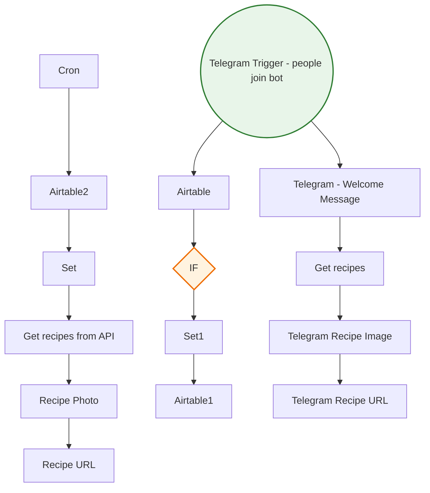

```mermaid
graph TD
    classDef trigger fill:#e8f5e9,stroke:#2e7d32,stroke-width:2px;
    classDef ai fill:#e3f2fd,stroke:#1565c0,stroke-width:2px;
    classDef logic fill:#fff3e0,stroke:#ef6c00,stroke-width:2px;

    Cron["Cron"]
    Airtable2["Airtable2"]
    Set["Set"]
    Recipe_Photo["Recipe Photo"]
    Recipe_URL["Recipe URL"]
    IF{"IF"}:::logic
    Airtable["Airtable"]
    Airtable1["Airtable1"]
    Telegram_Recipe_Image["Telegram Recipe Image"]
    Telegram_Recipe_URL["Telegram Recipe URL"]
    Set1["Set1"]
    Get_recipes_from_API["Get recipes from API"]
    Get_recipes["Get recipes"]
    Telegram_Trigger___people_join_bot(("Telegram Trigger - people join bot")):::trigger
    Telegram___Welcome_Message["Telegram - Welcome Message"]

    IF --> Set1
    Set --> Get_recipes_from_API
    Cron --> Airtable2
    Set1 --> Airtable1
    Airtable --> IF
    Airtable2 --> Set
    Get_recipes --> Telegram_Recipe_Image
    Recipe_Photo --> Recipe_URL
    Get_recipes_from_API --> Recipe_Photo
    Telegram_Recipe_Image --> Telegram_Recipe_URL
    Telegram___Welcome_Message --> Get_recipes
    Telegram_Trigger___people_join_bot --> Airtable
    Telegram_Trigger___people_join_bot --> Telegram___Welcome_Message
```
