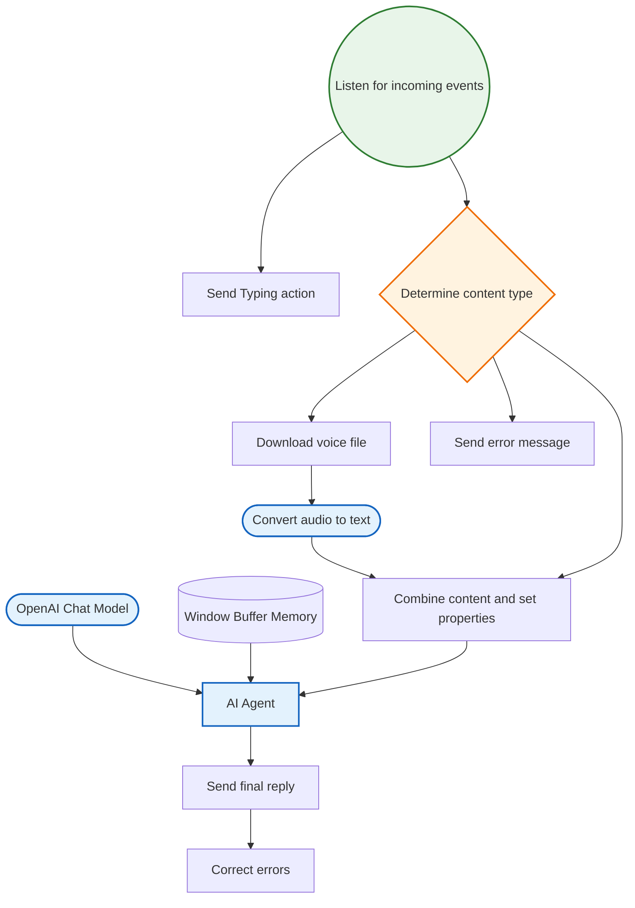

```mermaid
graph TD
    classDef trigger fill:#e8f5e9,stroke:#2e7d32,stroke-width:2px;
    classDef ai fill:#e3f2fd,stroke:#1565c0,stroke-width:2px;
    classDef logic fill:#fff3e0,stroke:#ef6c00,stroke-width:2px;

    OpenAI_Chat_Model(["OpenAI Chat Model"]):::ai
    Window_Buffer_Memory[("Window Buffer Memory")]
    Correct_errors["Correct errors"]
    Listen_for_incoming_events(("Listen for incoming events")):::trigger
    Download_voice_file["Download voice file"]
    Combine_content_and_set_properties["Combine content and set properties"]
    Send_final_reply["Send final reply"]
    Send_error_message["Send error message"]
    Convert_audio_to_text(["Convert audio to text"]):::ai
    Send_Typing_action["Send Typing action"]
    AI_Agent["AI Agent"]:::ai
    Determine_content_type{"Determine content type"}:::logic

    AI_Agent --> Send_final_reply
    Send_final_reply --> Correct_errors
    OpenAI_Chat_Model --> AI_Agent
    Download_voice_file --> Convert_audio_to_text
    Window_Buffer_Memory --> AI_Agent
    Convert_audio_to_text --> Combine_content_and_set_properties
    Determine_content_type --> Combine_content_and_set_properties
    Determine_content_type --> Download_voice_file
    Determine_content_type --> Send_error_message
    Listen_for_incoming_events --> Determine_content_type
    Listen_for_incoming_events --> Send_Typing_action
    Combine_content_and_set_properties --> AI_Agent
```
