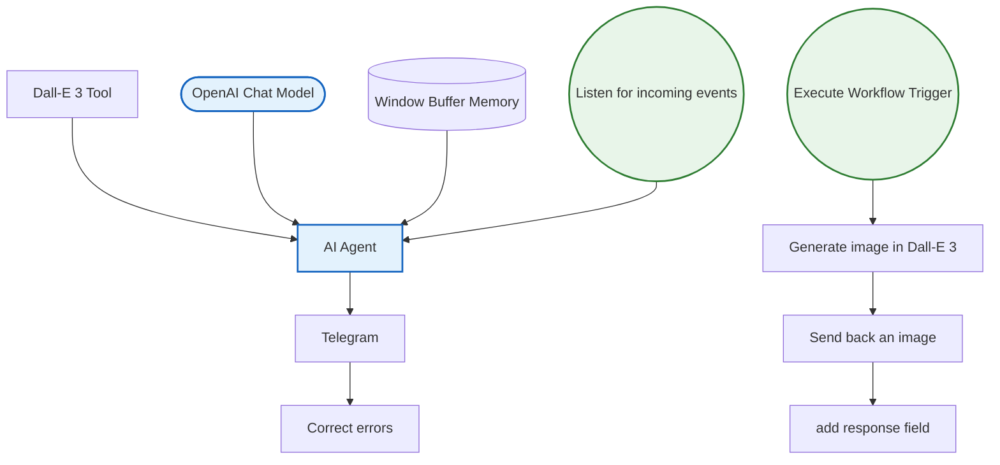

```mermaid
graph TD
    classDef trigger fill:#e8f5e9,stroke:#2e7d32,stroke-width:2px;
    classDef ai fill:#e3f2fd,stroke:#1565c0,stroke-width:2px;
    classDef logic fill:#fff3e0,stroke:#ef6c00,stroke-width:2px;

    OpenAI_Chat_Model(["OpenAI Chat Model"]):::ai
    Window_Buffer_Memory[("Window Buffer Memory")]
    Telegram["Telegram"]
    Correct_errors["Correct errors"]
    Execute_Workflow_Trigger(("Execute Workflow Trigger")):::trigger
    Listen_for_incoming_events(("Listen for incoming events")):::trigger
    Send_back_an_image["Send back an image"]
    add_response_field["add response field"]
    Dall_E_3_Tool["Dall-E 3 Tool"]
    Generate_image_in_Dall_E_3["Generate image in Dall-E 3"]
    AI_Agent["AI Agent"]:::ai

    AI_Agent --> Telegram
    Telegram --> Correct_errors
    Dall_E_3_Tool --> AI_Agent
    OpenAI_Chat_Model --> AI_Agent
    Send_back_an_image --> add_response_field
    Window_Buffer_Memory --> AI_Agent
    Execute_Workflow_Trigger --> Generate_image_in_Dall_E_3
    Generate_image_in_Dall_E_3 --> Send_back_an_image
    Listen_for_incoming_events --> AI_Agent
```
