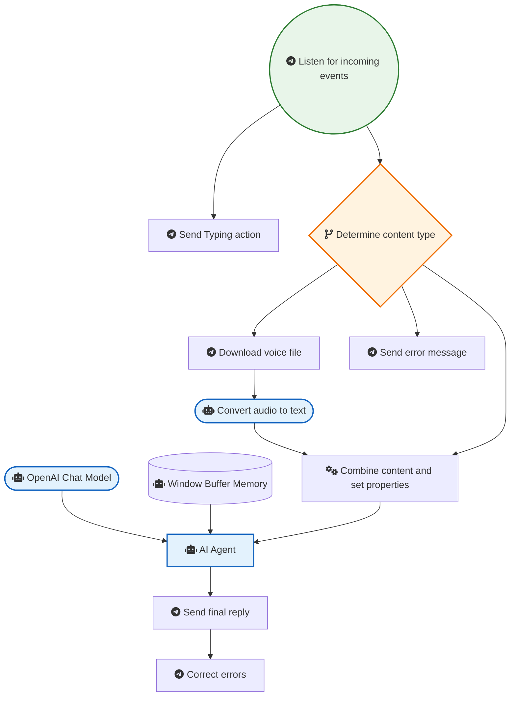

```mermaid
graph TD
    classDef trigger fill:#e8f5e9,stroke:#2e7d32,stroke-width:2px;
    classDef ai fill:#e3f2fd,stroke:#1565c0,stroke-width:2px;
    classDef logic fill:#fff3e0,stroke:#ef6c00,stroke-width:2px;

    OpenAI_Chat_Model(["fas:fa-robot OpenAI Chat Model"]):::ai
    Window_Buffer_Memory[("fas:fa-robot Window Buffer Memory")]
    Correct_errors["fab:fa-telegram Correct errors"]
    Listen_for_incoming_events(("fab:fa-telegram Listen for incoming events")):::trigger
    Download_voice_file["fab:fa-telegram Download voice file"]
    Combine_content_and_set_properties["fas:fa-cogs Combine content and set properties"]
    Send_final_reply["fab:fa-telegram Send final reply"]
    Send_error_message["fab:fa-telegram Send error message"]
    Convert_audio_to_text(["fas:fa-robot Convert audio to text"]):::ai
    Send_Typing_action["fab:fa-telegram Send Typing action"]
    AI_Agent["fas:fa-robot AI Agent"]:::ai
    Determine_content_type{"fas:fa-code-branch Determine content type"}:::logic

    AI_Agent --> Send_final_reply
    Send_final_reply --> Correct_errors
    OpenAI_Chat_Model --> AI_Agent
    Download_voice_file --> Convert_audio_to_text
    Window_Buffer_Memory --> AI_Agent
    Convert_audio_to_text --> Combine_content_and_set_properties
    Determine_content_type --> Combine_content_and_set_properties
    Determine_content_type --> Download_voice_file
    Determine_content_type --> Send_error_message
    Listen_for_incoming_events --> Determine_content_type
    Listen_for_incoming_events --> Send_Typing_action
    Combine_content_and_set_properties --> AI_Agent
```
