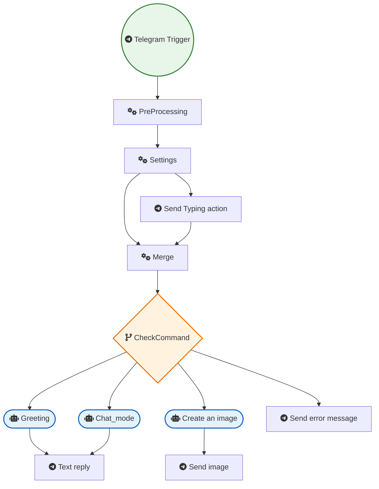

```mermaid
graph TD
    classDef trigger fill:#e8f5e9,stroke:#2e7d32,stroke-width:2px;
    classDef ai fill:#e3f2fd,stroke:#1565c0,stroke-width:2px;
    classDef logic fill:#fff3e0,stroke:#ef6c00,stroke-width:2px;

    Telegram_Trigger(("fab:fa-telegram Telegram Trigger")):::trigger
    CheckCommand{"fas:fa-code-branch CheckCommand"}:::logic
    Settings["fas:fa-cogs Settings"]
    Chat_mode(["fas:fa-robot Chat_mode"]):::ai
    Greeting(["fas:fa-robot Greeting"]):::ai
    Text_reply["fab:fa-telegram Text reply"]
    Send_Typing_action["fab:fa-telegram Send Typing action"]
    Merge["fas:fa-cogs Merge"]
    Create_an_image(["fas:fa-robot Create an image"]):::ai
    Send_error_message["fab:fa-telegram Send error message"]
    Send_image["fab:fa-telegram Send image"]
    PreProcessing["fas:fa-cogs PreProcessing"]

    Merge --> CheckCommand
    Greeting --> Text_reply
    Settings --> Send_Typing_action
    Settings --> Merge
    Chat_mode --> Text_reply
    CheckCommand --> Chat_mode
    CheckCommand --> Greeting
    CheckCommand --> Create_an_image
    CheckCommand --> Send_error_message
    PreProcessing --> Settings
    Create_an_image --> Send_image
    Telegram_Trigger --> PreProcessing
    Send_Typing_action --> Merge
```
