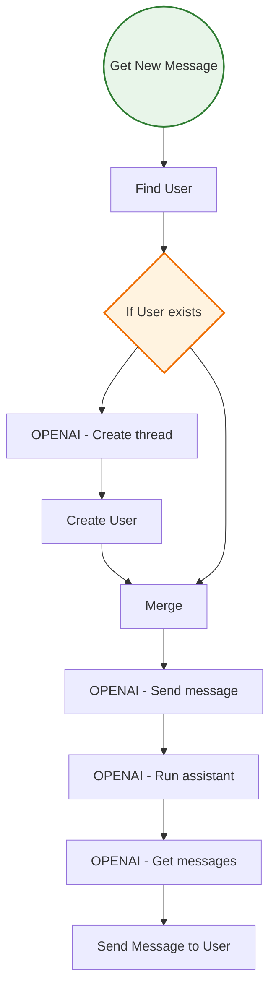

```mermaid
graph TD
    classDef trigger fill:#e8f5e9,stroke:#2e7d32,stroke-width:2px;
    classDef ai fill:#e3f2fd,stroke:#1565c0,stroke-width:2px;
    classDef logic fill:#fff3e0,stroke:#ef6c00,stroke-width:2px;

    Get_New_Message(("Get New Message")):::trigger
    OPENAI___Create_thread["OPENAI - Create thread"]
    Create_User["Create User"]
    Merge["Merge"]
    OPENAI___Send_message["OPENAI - Send message"]
    OPENAI___Run_assistant["OPENAI - Run assistant"]
    OPENAI___Get_messages["OPENAI - Get messages"]
    Send_Message_to_User["Send Message to User"]
    If_User_exists{"If User exists"}:::logic
    Find_User["Find User"]

    Merge --> OPENAI___Send_message
    Find_User --> If_User_exists
    Create_User --> Merge
    If_User_exists --> Merge
    If_User_exists --> OPENAI___Create_thread
    Get_New_Message --> Find_User
    OPENAI___Get_messages --> Send_Message_to_User
    OPENAI___Send_message --> OPENAI___Run_assistant
    OPENAI___Create_thread --> Create_User
    OPENAI___Run_assistant --> OPENAI___Get_messages
```
