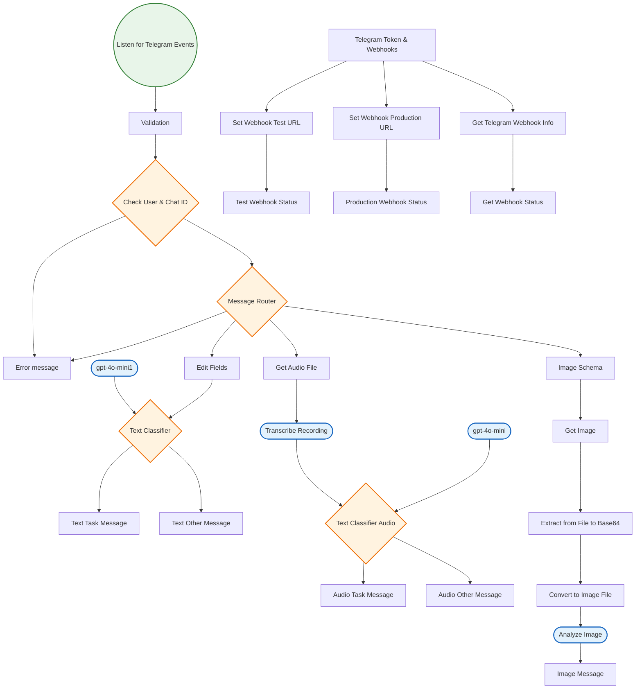

```mermaid
graph TD
    classDef trigger fill:#e8f5e9,stroke:#2e7d32,stroke-width:2px;
    classDef ai fill:#e3f2fd,stroke:#1565c0,stroke-width:2px;
    classDef logic fill:#fff3e0,stroke:#ef6c00,stroke-width:2px;

    Check_User___Chat_ID{"Check User & Chat ID"}:::logic
    Error_message["Error message"]
    Listen_for_Telegram_Events(("Listen for Telegram Events")):::trigger
    Set_Webhook_Test_URL["Set Webhook Test URL"]
    Get_Telegram_Webhook_Info["Get Telegram Webhook Info"]
    Image_Schema["Image Schema"]
    gpt_4o_mini(["gpt-4o-mini"]):::ai
    Get_Audio_File["Get Audio File"]
    Get_Image["Get Image"]
    Analyze_Image(["Analyze Image"]):::ai
    Transcribe_Recording(["Transcribe Recording"]):::ai
    gpt_4o_mini1(["gpt-4o-mini1"]):::ai
    Test_Webhook_Status["Test Webhook Status"]
    Production_Webhook_Status["Production Webhook Status"]
    Set_Webhook_Production_URL["Set Webhook Production URL"]
    Edit_Fields["Edit Fields"]
    Audio_Task_Message["Audio Task Message"]
    Audio_Other_Message["Audio Other Message"]
    Text_Task_Message["Text Task Message"]
    Text_Other_Message["Text Other Message"]
    Image_Message["Image Message"]
    Convert_to_Image_File["Convert to Image File"]
    Extract_from_File_to_Base64["Extract from File to Base64"]
    Text_Classifier_Audio{"Text Classifier Audio"}:::logic
    Text_Classifier{"Text Classifier"}:::logic
    Telegram_Token___Webhooks["Telegram Token & Webhooks"]
    Get_Webhook_Status["Get Webhook Status"]
    Validation["Validation"]
    Message_Router{"Message Router"}:::logic

    Get_Image --> Extract_from_File_to_Base64
    Validation --> Check_User___Chat_ID
    Edit_Fields --> Text_Classifier
    gpt_4o_mini --> Text_Classifier_Audio
    Image_Schema --> Get_Image
    gpt_4o_mini1 --> Text_Classifier
    Analyze_Image --> Image_Message
    Get_Audio_File --> Transcribe_Recording
    Message_Router --> Get_Audio_File
    Message_Router --> Edit_Fields
    Message_Router --> Image_Schema
    Message_Router --> Error_message
    Text_Classifier --> Text_Task_Message
    Text_Classifier --> Text_Other_Message
    Check_User___Chat_ID --> Message_Router
    Check_User___Chat_ID --> Error_message
    Set_Webhook_Test_URL --> Test_Webhook_Status
    Transcribe_Recording --> Text_Classifier_Audio
    Convert_to_Image_File --> Analyze_Image
    Text_Classifier_Audio --> Audio_Task_Message
    Text_Classifier_Audio --> Audio_Other_Message
    Get_Telegram_Webhook_Info --> Get_Webhook_Status
    Telegram_Token___Webhooks --> Set_Webhook_Production_URL
    Telegram_Token___Webhooks --> Set_Webhook_Test_URL
    Telegram_Token___Webhooks --> Get_Telegram_Webhook_Info
    Listen_for_Telegram_Events --> Validation
    Set_Webhook_Production_URL --> Production_Webhook_Status
    Extract_from_File_to_Base64 --> Convert_to_Image_File
```
