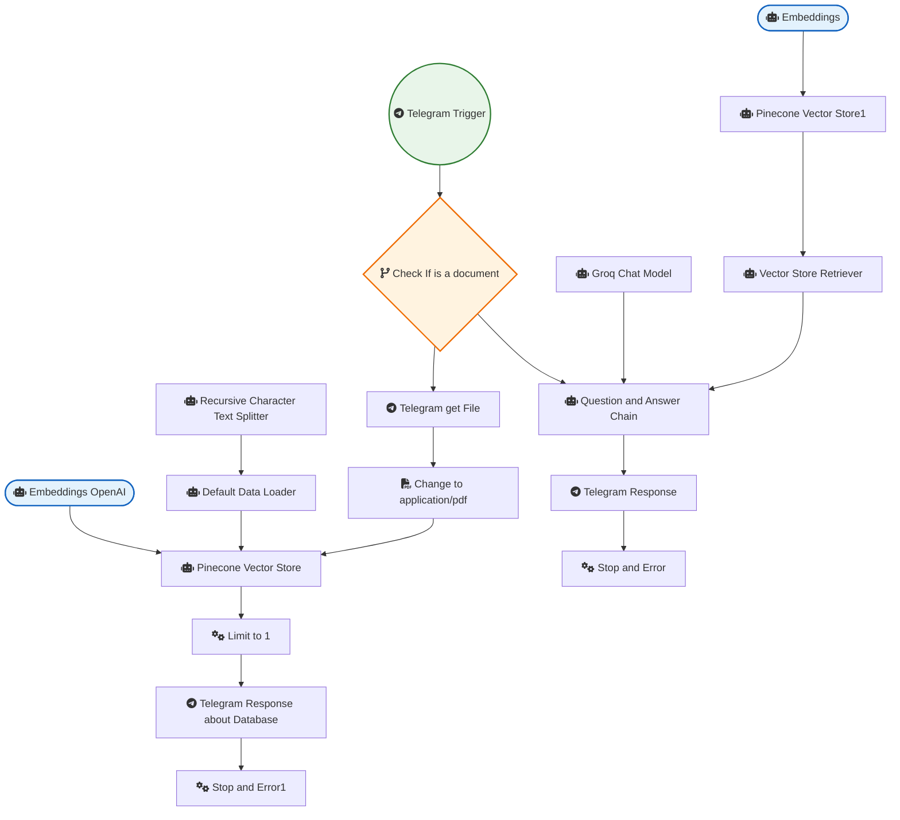

```mermaid
graph TD
    classDef trigger fill:#e8f5e9,stroke:#2e7d32,stroke-width:2px;
    classDef ai fill:#e3f2fd,stroke:#1565c0,stroke-width:2px;
    classDef logic fill:#fff3e0,stroke:#ef6c00,stroke-width:2px;

    Telegram_Trigger(("fab:fa-telegram Telegram Trigger")):::trigger
    Embeddings_OpenAI(["fas:fa-robot Embeddings OpenAI"]):::ai
    Default_Data_Loader["fas:fa-robot Default Data Loader"]
    Recursive_Character_Text_Splitter["fas:fa-robot Recursive Character Text Splitter"]
    Stop_and_Error["fas:fa-cogs Stop and Error"]
    Question_and_Answer_Chain["fas:fa-robot Question and Answer Chain"]
    Vector_Store_Retriever["fas:fa-robot Vector Store Retriever"]
    Pinecone_Vector_Store1["fas:fa-robot Pinecone Vector Store1"]
    Groq_Chat_Model["fas:fa-robot Groq Chat Model"]
    Check_If_is_a_document{"fas:fa-code-branch Check If is a document"}:::logic
    Change_to_application_pdf["fas:fa-file-pdf Change to application/pdf"]
    Telegram_get_File["fab:fa-telegram Telegram get File"]
    Embeddings(["fas:fa-robot Embeddings"]):::ai
    Telegram_Response["fab:fa-telegram Telegram Response"]
    Telegram_Response_about_Database["fab:fa-telegram Telegram Response about Database"]
    Stop_and_Error1["fas:fa-cogs Stop and Error1"]
    Pinecone_Vector_Store["fas:fa-robot Pinecone Vector Store"]
    Limit_to_1["fas:fa-cogs Limit to 1"]

    Embeddings --> Pinecone_Vector_Store1
    Limit_to_1 --> Telegram_Response_about_Database
    Groq_Chat_Model --> Question_and_Answer_Chain
    Telegram_Trigger --> Check_If_is_a_document
    Embeddings_OpenAI --> Pinecone_Vector_Store
    Telegram_Response --> Stop_and_Error
    Telegram_get_File --> Change_to_application_pdf
    Default_Data_Loader --> Pinecone_Vector_Store
    Pinecone_Vector_Store --> Limit_to_1
    Check_If_is_a_document --> Telegram_get_File
    Check_If_is_a_document --> Question_and_Answer_Chain
    Pinecone_Vector_Store1 --> Vector_Store_Retriever
    Vector_Store_Retriever --> Question_and_Answer_Chain
    Change_to_application_pdf --> Pinecone_Vector_Store
    Question_and_Answer_Chain --> Telegram_Response
    Telegram_Response_about_Database --> Stop_and_Error1
    Recursive_Character_Text_Splitter --> Default_Data_Loader
```
