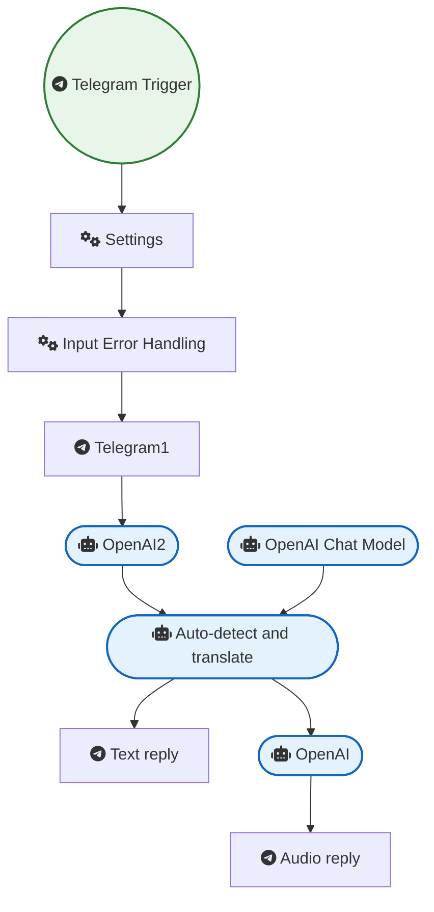

```mermaid
graph TD
    classDef trigger fill:#e8f5e9,stroke:#2e7d32,stroke-width:2px;
    classDef ai fill:#e3f2fd,stroke:#1565c0,stroke-width:2px;
    classDef logic fill:#fff3e0,stroke:#ef6c00,stroke-width:2px;

    Telegram_Trigger(("fab:fa-telegram Telegram Trigger")):::trigger
    Text_reply["fab:fa-telegram Text reply"]
    Telegram1["fab:fa-telegram Telegram1"]
    OpenAI_Chat_Model(["fas:fa-robot OpenAI Chat Model"]):::ai
    Input_Error_Handling["fas:fa-cogs Input Error Handling"]
    Settings["fas:fa-cogs Settings"]
    Auto_detect_and_translate(["fas:fa-robot Auto-detect and translate"]):::ai
    Audio_reply["fab:fa-telegram Audio reply"]
    OpenAI2(["fas:fa-robot OpenAI2"]):::ai
    OpenAI(["fas:fa-robot OpenAI"]):::ai

    OpenAI --> Audio_reply
    OpenAI2 --> Auto_detect_and_translate
    Settings --> Input_Error_Handling
    Telegram1 --> OpenAI2
    Telegram_Trigger --> Settings
    OpenAI_Chat_Model --> Auto_detect_and_translate
    Input_Error_Handling --> Telegram1
    Auto_detect_and_translate --> Text_reply
    Auto_detect_and_translate --> OpenAI
```
