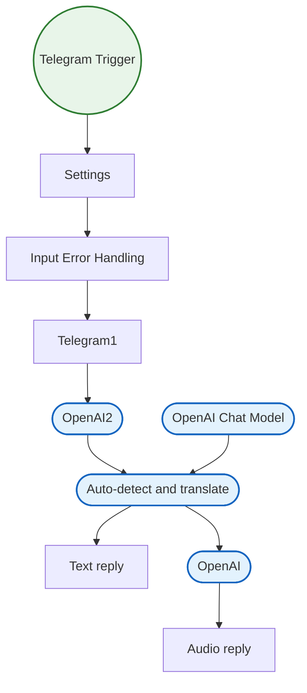

```mermaid
graph TD
    classDef trigger fill:#e8f5e9,stroke:#2e7d32,stroke-width:2px;
    classDef ai fill:#e3f2fd,stroke:#1565c0,stroke-width:2px;
    classDef logic fill:#fff3e0,stroke:#ef6c00,stroke-width:2px;

    Telegram_Trigger(("Telegram Trigger")):::trigger
    Text_reply["Text reply"]
    Telegram1["Telegram1"]
    OpenAI_Chat_Model(["OpenAI Chat Model"]):::ai
    Input_Error_Handling["Input Error Handling"]
    Settings["Settings"]
    Auto_detect_and_translate(["Auto-detect and translate"]):::ai
    Audio_reply["Audio reply"]
    OpenAI2(["OpenAI2"]):::ai
    OpenAI(["OpenAI"]):::ai

    OpenAI --> Audio_reply
    OpenAI2 --> Auto_detect_and_translate
    Settings --> Input_Error_Handling
    Telegram1 --> OpenAI2
    Telegram_Trigger --> Settings
    OpenAI_Chat_Model --> Auto_detect_and_translate
    Input_Error_Handling --> Telegram1
    Auto_detect_and_translate --> Text_reply
    Auto_detect_and_translate --> OpenAI
```
