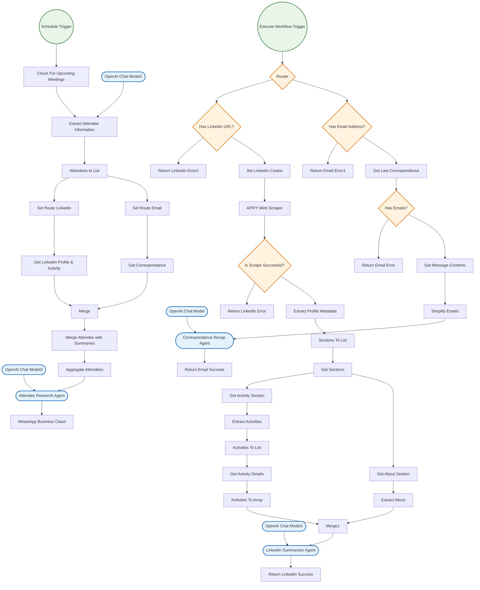

```mermaid
graph TD
    classDef trigger fill:#e8f5e9,stroke:#2e7d32,stroke-width:2px;
    classDef ai fill:#e3f2fd,stroke:#1565c0,stroke-width:2px;
    classDef logic fill:#fff3e0,stroke:#ef6c00,stroke-width:2px;

    Get_Message_Contents["Get Message Contents"]
    Simplify_Emails["Simplify Emails"]
    Check_For_Upcoming_Meetings["Check For Upcoming Meetings"]
    OpenAI_Chat_Model2(["OpenAI Chat Model2"]):::ai
    Extract_Attendee_Information["Extract Attendee Information"]
    Execute_Workflow_Trigger(("Execute Workflow Trigger")):::trigger
    OpenAI_Chat_Model(["OpenAI Chat Model"]):::ai
    Get_Last_Correspondence["Get Last Correspondence"]
    OpenAI_Chat_Model1(["OpenAI Chat Model1"]):::ai
    OpenAI_Chat_Model3(["OpenAI Chat Model3"]):::ai
    WhatsApp_Business_Cloud["WhatsApp Business Cloud"]
    Schedule_Trigger(("Schedule Trigger")):::trigger
    Return_LinkedIn_Success["Return LinkedIn Success"]
    Return_LinkedIn_Error["Return LinkedIn Error"]
    Return_Email_Error["Return Email Error"]
    Return_Email_Success["Return Email Success"]
    Set_Route_Email["Set Route Email"]
    Set_Route_Linkedin["Set Route Linkedin"]
    Router{"Router"}:::logic
    Return_LinkedIn_Error1["Return LinkedIn Error1"]
    Has_Emails_{"Has Emails?"}:::logic
    Return_Email_Error1["Return Email Error1"]
    Sections_To_List["Sections To List"]
    Set_LinkedIn_Cookie["Set LinkedIn Cookie"]
    Attendees_to_List["Attendees to List"]
    Merge_Attendee_with_Summaries["Merge Attendee with Summaries"]
    Has_Email_Address_{"Has Email Address?"}:::logic
    Has_LinkedIn_URL_{"Has LinkedIn URL?"}:::logic
    Get_Correspondance["Get Correspondance"]
    Merge["Merge"]
    Aggregate_Attendees["Aggregate Attendees"]
    Activities_To_Array["Activities To Array"]
    Extract_Profile_Metadata["Extract Profile Metadata"]
    Activities_To_List["Activities To List"]
    APIFY_Web_Scraper["APIFY Web Scraper"]
    Get_Activity_Details["Get Activity Details"]
    Get_Sections["Get Sections"]
    Get_About_Section["Get About Section"]
    Get_Activity_Section["Get Activity Section"]
    Extract_Activities["Extract Activities"]
    Merge1["Merge1"]
    Is_Scrape_Successful_{"Is Scrape Successful?"}:::logic
    Extract_About["Extract About"]
    Get_LinkedIn_Profile___Activity["Get LinkedIn Profile & Activity"]
    Correspondance_Recap_Agent(["Correspondance Recap Agent"]):::ai
    Attendee_Research_Agent(["Attendee Research Agent"]):::ai
    LinkedIn_Summarizer_Agent(["LinkedIn Summarizer Agent"]):::ai

    Merge --> Merge_Attendee_with_Summaries
    Merge1 --> LinkedIn_Summarizer_Agent
    Router --> Has_Email_Address_
    Router --> Has_LinkedIn_URL_
    Has_Emails_ --> Get_Message_Contents
    Has_Emails_ --> Return_Email_Error
    Get_Sections --> Get_About_Section
    Get_Sections --> Get_Activity_Section
    Extract_About --> Merge1
    Set_Route_Email --> Get_Correspondance
    Simplify_Emails --> Correspondance_Recap_Agent
    Schedule_Trigger --> Check_For_Upcoming_Meetings
    Sections_To_List --> Get_Sections
    APIFY_Web_Scraper --> Is_Scrape_Successful_
    Attendees_to_List --> Set_Route_Email
    Attendees_to_List --> Set_Route_Linkedin
    Get_About_Section --> Extract_About
    Has_LinkedIn_URL_ --> Set_LinkedIn_Cookie
    Has_LinkedIn_URL_ --> Return_LinkedIn_Error1
    OpenAI_Chat_Model --> Correspondance_Recap_Agent
    Activities_To_List --> Get_Activity_Details
    Extract_Activities --> Activities_To_List
    Get_Correspondance --> Merge
    Has_Email_Address_ --> Get_Last_Correspondence
    Has_Email_Address_ --> Return_Email_Error1
    OpenAI_Chat_Model1 --> LinkedIn_Summarizer_Agent
    OpenAI_Chat_Model2 --> Extract_Attendee_Information
    OpenAI_Chat_Model3 --> Attendee_Research_Agent
    Set_Route_Linkedin --> Get_LinkedIn_Profile___Activity
    Activities_To_Array --> Merge1
    Aggregate_Attendees --> Attendee_Research_Agent
    Set_LinkedIn_Cookie --> APIFY_Web_Scraper
    Get_Activity_Details --> Activities_To_Array
    Get_Activity_Section --> Extract_Activities
    Get_Message_Contents --> Simplify_Emails
    Is_Scrape_Successful_ --> Extract_Profile_Metadata
    Is_Scrape_Successful_ --> Return_LinkedIn_Error
    Attendee_Research_Agent --> WhatsApp_Business_Cloud
    Get_Last_Correspondence --> Has_Emails_
    Execute_Workflow_Trigger --> Router
    Extract_Profile_Metadata --> Sections_To_List
    LinkedIn_Summarizer_Agent --> Return_LinkedIn_Success
    Correspondance_Recap_Agent --> Return_Email_Success
    Check_For_Upcoming_Meetings --> Extract_Attendee_Information
    Extract_Attendee_Information --> Attendees_to_List
    Merge_Attendee_with_Summaries --> Aggregate_Attendees
    Get_LinkedIn_Profile___Activity --> Merge
```
