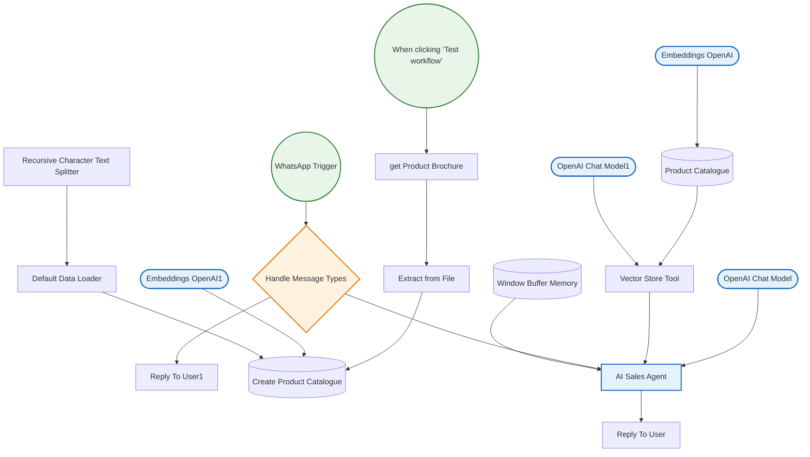

```mermaid
graph TD
    classDef trigger fill:#e8f5e9,stroke:#2e7d32,stroke-width:2px;
    classDef ai fill:#e3f2fd,stroke:#1565c0,stroke-width:2px;
    classDef logic fill:#fff3e0,stroke:#ef6c00,stroke-width:2px;

    WhatsApp_Trigger(("WhatsApp Trigger")):::trigger
    OpenAI_Chat_Model(["OpenAI Chat Model"]):::ai
    Window_Buffer_Memory[("Window Buffer Memory")]
    Vector_Store_Tool["Vector Store Tool"]
    Embeddings_OpenAI(["Embeddings OpenAI"]):::ai
    OpenAI_Chat_Model1(["OpenAI Chat Model1"]):::ai
    When_clicking__Test_workflow_(("When clicking ‘Test workflow’")):::trigger
    Embeddings_OpenAI1(["Embeddings OpenAI1"]):::ai
    Default_Data_Loader["Default Data Loader"]
    Recursive_Character_Text_Splitter["Recursive Character Text Splitter"]
    Extract_from_File["Extract from File"]
    get_Product_Brochure["get Product Brochure"]
    Reply_To_User["Reply To User"]
    Reply_To_User1["Reply To User1"]
    Product_Catalogue[("Product Catalogue")]
    Create_Product_Catalogue[("Create Product Catalogue")]
    Handle_Message_Types{"Handle Message Types"}:::logic
    AI_Sales_Agent["AI Sales Agent"]:::ai

    AI_Sales_Agent --> Reply_To_User
    WhatsApp_Trigger --> Handle_Message_Types
    Embeddings_OpenAI --> Product_Catalogue
    Extract_from_File --> Create_Product_Catalogue
    OpenAI_Chat_Model --> AI_Sales_Agent
    Product_Catalogue --> Vector_Store_Tool
    Vector_Store_Tool --> AI_Sales_Agent
    Embeddings_OpenAI1 --> Create_Product_Catalogue
    OpenAI_Chat_Model1 --> Vector_Store_Tool
    Default_Data_Loader --> Create_Product_Catalogue
    Handle_Message_Types --> AI_Sales_Agent
    Handle_Message_Types --> Reply_To_User1
    Window_Buffer_Memory --> AI_Sales_Agent
    get_Product_Brochure --> Extract_from_File
    Recursive_Character_Text_Splitter --> Default_Data_Loader
    When_clicking__Test_workflow_ --> get_Product_Brochure
```
