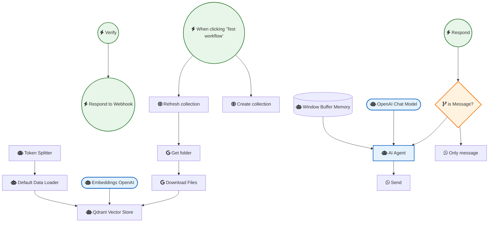

```mermaid
graph TD
    classDef trigger fill:#e8f5e9,stroke:#2e7d32,stroke-width:2px;
    classDef ai fill:#e3f2fd,stroke:#1565c0,stroke-width:2px;
    classDef logic fill:#fff3e0,stroke:#ef6c00,stroke-width:2px;

    Respond_to_Webhook(("fas:fa-bolt Respond to Webhook")):::trigger
    AI_Agent["fas:fa-robot AI Agent"]:::ai
    OpenAI_Chat_Model(["fas:fa-robot OpenAI Chat Model"]):::ai
    When_clicking__Test_workflow_(("fas:fa-bolt When clicking ‘Test workflow’")):::trigger
    Qdrant_Vector_Store["fas:fa-robot Qdrant Vector Store"]
    Create_collection["fas:fa-globe Create collection"]
    Refresh_collection["fas:fa-globe Refresh collection"]
    Get_folder["fab:fa-google Get folder"]
    Download_Files["fab:fa-google Download Files"]
    Embeddings_OpenAI(["fas:fa-robot Embeddings OpenAI"]):::ai
    Default_Data_Loader["fas:fa-robot Default Data Loader"]
    Token_Splitter["fas:fa-robot Token Splitter"]
    Verify(("fas:fa-bolt Verify")):::trigger
    Respond(("fas:fa-bolt Respond")):::trigger
    is_Message_{"fas:fa-code-branch is Message?"}:::logic
    Only_message["fab:fa-whatsapp Only message"]
    Send["fab:fa-whatsapp Send"]
    Window_Buffer_Memory[("fas:fa-robot Window Buffer Memory")]

    Verify --> Respond_to_Webhook
    Respond --> is_Message_
    AI_Agent --> Send
    Get_folder --> Download_Files
    is_Message_ --> AI_Agent
    is_Message_ --> Only_message
    Download_Files --> Qdrant_Vector_Store
    Token_Splitter --> Default_Data_Loader
    Embeddings_OpenAI --> Qdrant_Vector_Store
    OpenAI_Chat_Model --> AI_Agent
    Refresh_collection --> Get_folder
    Default_Data_Loader --> Qdrant_Vector_Store
    Window_Buffer_Memory --> AI_Agent
    When_clicking__Test_workflow_ --> Create_collection
    When_clicking__Test_workflow_ --> Refresh_collection
```
