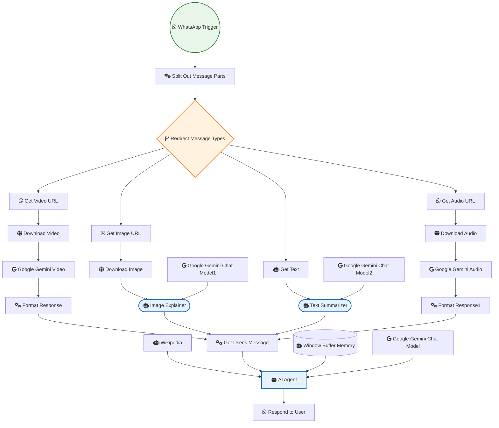

```mermaid
graph TD
    classDef trigger fill:#e8f5e9,stroke:#2e7d32,stroke-width:2px;
    classDef ai fill:#e3f2fd,stroke:#1565c0,stroke-width:2px;
    classDef logic fill:#fff3e0,stroke:#ef6c00,stroke-width:2px;

    WhatsApp_Trigger(("fab:fa-whatsapp WhatsApp Trigger")):::trigger
    Get_Audio_URL["fab:fa-whatsapp Get Audio URL"]
    Get_Video_URL["fab:fa-whatsapp Get Video URL"]
    Get_Image_URL["fab:fa-whatsapp Get Image URL"]
    Download_Video["fas:fa-globe Download Video"]
    Download_Audio["fas:fa-globe Download Audio"]
    Download_Image["fas:fa-globe Download Image"]
    Window_Buffer_Memory[("fas:fa-robot Window Buffer Memory")]
    Get_User_s_Message["fas:fa-cogs Get User's Message"]
    Split_Out_Message_Parts["fas:fa-cogs Split Out Message Parts"]
    Wikipedia["fas:fa-robot Wikipedia"]
    Redirect_Message_Types{"fas:fa-code-branch Redirect Message Types"}:::logic
    Get_Text["fas:fa-robot Get Text"]
    Respond_to_User["fab:fa-whatsapp Respond to User"]
    Image_Explainer(["fas:fa-robot Image Explainer"]):::ai
    Format_Response["fas:fa-cogs Format Response"]
    Google_Gemini_Chat_Model["fab:fa-google Google Gemini Chat Model"]
    Google_Gemini_Audio["fab:fa-google Google Gemini Audio"]
    Google_Gemini_Video["fab:fa-google Google Gemini Video"]
    Google_Gemini_Chat_Model1["fab:fa-google Google Gemini Chat Model1"]
    Google_Gemini_Chat_Model2["fab:fa-google Google Gemini Chat Model2"]
    Format_Response1["fas:fa-cogs Format Response1"]
    Text_Summarizer(["fas:fa-robot Text Summarizer"]):::ai
    AI_Agent["fas:fa-robot AI Agent"]:::ai

    AI_Agent --> Respond_to_User
    Get_Text --> Text_Summarizer
    Wikipedia --> AI_Agent
    Get_Audio_URL --> Download_Audio
    Get_Image_URL --> Download_Image
    Get_Video_URL --> Download_Video
    Download_Audio --> Google_Gemini_Audio
    Download_Image --> Image_Explainer
    Download_Video --> Google_Gemini_Video
    Format_Response --> Get_User_s_Message
    Image_Explainer --> Get_User_s_Message
    Text_Summarizer --> Get_User_s_Message
    Format_Response1 --> Get_User_s_Message
    WhatsApp_Trigger --> Split_Out_Message_Parts
    Get_User_s_Message --> AI_Agent
    Google_Gemini_Audio --> Format_Response1
    Google_Gemini_Video --> Format_Response
    Window_Buffer_Memory --> AI_Agent
    Redirect_Message_Types --> Get_Audio_URL
    Redirect_Message_Types --> Get_Video_URL
    Redirect_Message_Types --> Get_Image_URL
    Redirect_Message_Types --> Get_Text
    Split_Out_Message_Parts --> Redirect_Message_Types
    Google_Gemini_Chat_Model --> AI_Agent
    Google_Gemini_Chat_Model1 --> Image_Explainer
    Google_Gemini_Chat_Model2 --> Text_Summarizer
```
