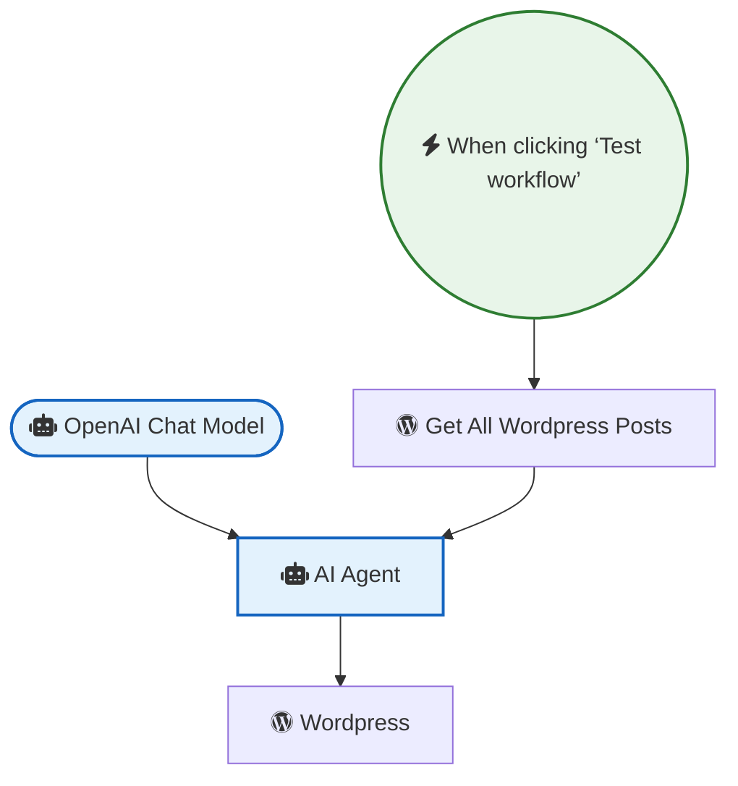

```mermaid
graph TD
    classDef trigger fill:#e8f5e9,stroke:#2e7d32,stroke-width:2px;
    classDef ai fill:#e3f2fd,stroke:#1565c0,stroke-width:2px;
    classDef logic fill:#fff3e0,stroke:#ef6c00,stroke-width:2px;

    When_clicking__Test_workflow_(("fas:fa-bolt When clicking ‘Test workflow’")):::trigger
    Wordpress["fab:fa-wordpress Wordpress"]
    Get_All_Wordpress_Posts["fab:fa-wordpress Get All Wordpress Posts"]
    OpenAI_Chat_Model(["fas:fa-robot OpenAI Chat Model"]):::ai
    AI_Agent["fas:fa-robot AI Agent"]:::ai

    AI_Agent --> Wordpress
    OpenAI_Chat_Model --> AI_Agent
    Get_All_Wordpress_Posts --> AI_Agent
    When_clicking__Test_workflow_ --> Get_All_Wordpress_Posts
```
