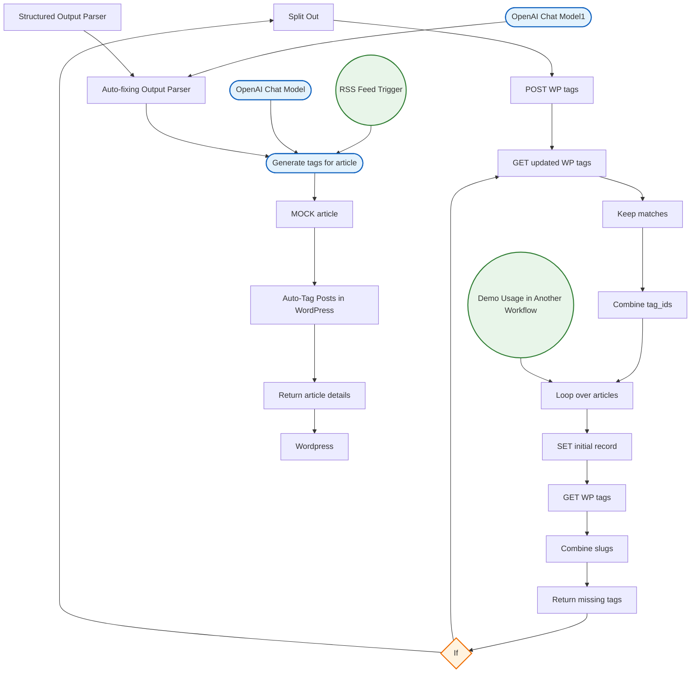

```mermaid
graph TD
    classDef trigger fill:#e8f5e9,stroke:#2e7d32,stroke-width:2px;
    classDef ai fill:#e3f2fd,stroke:#1565c0,stroke-width:2px;
    classDef logic fill:#fff3e0,stroke:#ef6c00,stroke-width:2px;

    OpenAI_Chat_Model(["OpenAI Chat Model"]):::ai
    Auto_fixing_Output_Parser["Auto-fixing Output Parser"]
    OpenAI_Chat_Model1(["OpenAI Chat Model1"]):::ai
    Structured_Output_Parser["Structured Output Parser"]
    RSS_Feed_Trigger(("RSS Feed Trigger")):::trigger
    Return_article_details["Return article details"]
    Split_Out["Split Out"]
    Loop_over_articles["Loop over articles"]
    SET_initial_record["SET initial record"]
    GET_WP_tags["GET WP tags"]
    POST_WP_tags["POST WP tags"]
    GET_updated_WP_tags["GET updated WP tags"]
    Keep_matches["Keep matches"]
    Combine_tag_ids["Combine tag_ids"]
    Combine_slugs["Combine slugs"]
    If{"If"}:::logic
    MOCK_article["MOCK article"]
    Return_missing_tags["Return missing tags"]
    Wordpress["Wordpress"]
    Demo_Usage_in_Another_Workflow(("Demo Usage in Another Workflow")):::trigger
    Auto_Tag_Posts_in_WordPress["Auto-Tag Posts in WordPress"]
    Generate_tags_for_article(["Generate tags for article"]):::ai

    If --> GET_updated_WP_tags
    If --> Split_Out
    Split_Out --> POST_WP_tags
    GET_WP_tags --> Combine_slugs
    Keep_matches --> Combine_tag_ids
    MOCK_article --> Auto_Tag_Posts_in_WordPress
    POST_WP_tags --> GET_updated_WP_tags
    Combine_slugs --> Return_missing_tags
    Combine_tag_ids --> Loop_over_articles
    RSS_Feed_Trigger --> Generate_tags_for_article
    OpenAI_Chat_Model --> Generate_tags_for_article
    Loop_over_articles --> SET_initial_record
    OpenAI_Chat_Model1 --> Auto_fixing_Output_Parser
    SET_initial_record --> GET_WP_tags
    GET_updated_WP_tags --> Keep_matches
    Return_missing_tags --> If
    Return_article_details --> Wordpress
    Structured_Output_Parser --> Auto_fixing_Output_Parser
    Auto_fixing_Output_Parser --> Generate_tags_for_article
    Generate_tags_for_article --> MOCK_article
    Auto_Tag_Posts_in_WordPress --> Return_article_details
    Demo_Usage_in_Another_Workflow --> Loop_over_articles
```
