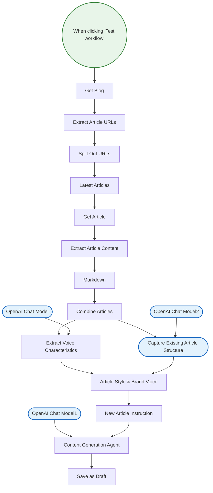

```mermaid
graph TD
    classDef trigger fill:#e8f5e9,stroke:#2e7d32,stroke-width:2px;
    classDef ai fill:#e3f2fd,stroke:#1565c0,stroke-width:2px;
    classDef logic fill:#fff3e0,stroke:#ef6c00,stroke-width:2px;

    When_clicking__Test_workflow_(("When clicking ‘Test workflow’")):::trigger
    OpenAI_Chat_Model(["OpenAI Chat Model"]):::ai
    OpenAI_Chat_Model1(["OpenAI Chat Model1"]):::ai
    OpenAI_Chat_Model2(["OpenAI Chat Model2"]):::ai
    Extract_Voice_Characteristics["Extract Voice Characteristics"]
    Get_Blog["Get Blog"]
    Get_Article["Get Article"]
    Extract_Article_URLs["Extract Article URLs"]
    Split_Out_URLs["Split Out URLs"]
    Latest_Articles["Latest Articles"]
    Extract_Article_Content["Extract Article Content"]
    Combine_Articles["Combine Articles"]
    Article_Style___Brand_Voice["Article Style & Brand Voice"]
    Save_as_Draft["Save as Draft"]
    Capture_Existing_Article_Structure(["Capture Existing Article Structure"]):::ai
    Markdown["Markdown"]
    Content_Generation_Agent["Content Generation Agent"]
    New_Article_Instruction["New Article Instruction"]

    Get_Blog --> Extract_Article_URLs
    Markdown --> Combine_Articles
    Get_Article --> Extract_Article_Content
    Split_Out_URLs --> Latest_Articles
    Latest_Articles --> Get_Article
    Combine_Articles --> Capture_Existing_Article_Structure
    Combine_Articles --> Extract_Voice_Characteristics
    OpenAI_Chat_Model --> Extract_Voice_Characteristics
    OpenAI_Chat_Model1 --> Content_Generation_Agent
    OpenAI_Chat_Model2 --> Capture_Existing_Article_Structure
    Extract_Article_URLs --> Split_Out_URLs
    Extract_Article_Content --> Markdown
    New_Article_Instruction --> Content_Generation_Agent
    Content_Generation_Agent --> Save_as_Draft
    Article_Style___Brand_Voice --> New_Article_Instruction
    Extract_Voice_Characteristics --> Article_Style___Brand_Voice
    When_clicking__Test_workflow_ --> Get_Blog
    Capture_Existing_Article_Structure --> Article_Style___Brand_Voice
```
