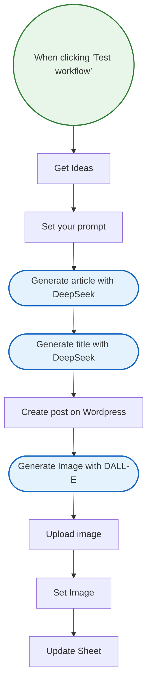

```mermaid
graph TD
    classDef trigger fill:#e8f5e9,stroke:#2e7d32,stroke-width:2px;
    classDef ai fill:#e3f2fd,stroke:#1565c0,stroke-width:2px;
    classDef logic fill:#fff3e0,stroke:#ef6c00,stroke-width:2px;

    When_clicking__Test_workflow_(("When clicking ‘Test workflow’")):::trigger
    Get_Ideas["Get Ideas"]
    Set_your_prompt["Set your prompt"]
    Create_post_on_Wordpress["Create post on Wordpress"]
    Upload_image["Upload image"]
    Set_Image["Set Image"]
    Update_Sheet["Update Sheet"]
    Generate_article_with_DeepSeek(["Generate article with DeepSeek"]):::ai
    Generate_title_with_DeepSeek(["Generate title with DeepSeek"]):::ai
    Generate_Image_with_DALL_E(["Generate Image with DALL-E"]):::ai

    Get_Ideas --> Set_your_prompt
    Set_Image --> Update_Sheet
    Upload_image --> Set_Image
    Set_your_prompt --> Generate_article_with_DeepSeek
    Create_post_on_Wordpress --> Generate_Image_with_DALL_E
    Generate_Image_with_DALL_E --> Upload_image
    Generate_title_with_DeepSeek --> Create_post_on_Wordpress
    Generate_article_with_DeepSeek --> Generate_title_with_DeepSeek
    When_clicking__Test_workflow_ --> Get_Ideas
```
