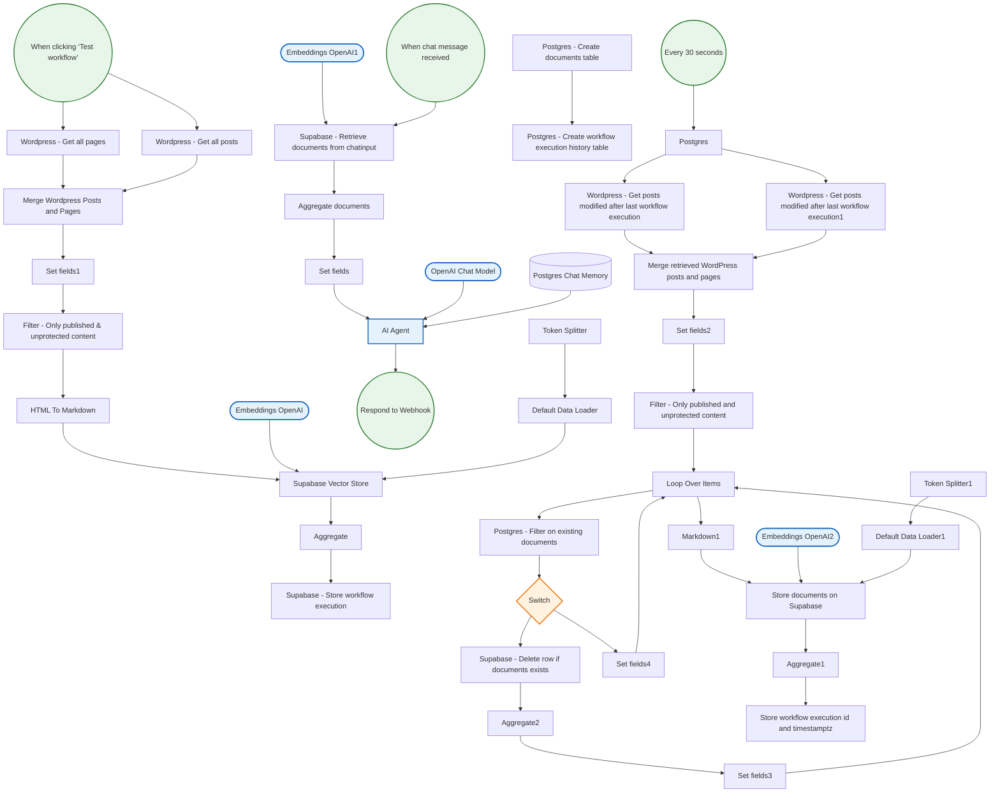

```mermaid
graph TD
    classDef trigger fill:#e8f5e9,stroke:#2e7d32,stroke-width:2px;
    classDef ai fill:#e3f2fd,stroke:#1565c0,stroke-width:2px;
    classDef logic fill:#fff3e0,stroke:#ef6c00,stroke-width:2px;

    When_clicking__Test_workflow_(("When clicking ‘Test workflow’")):::trigger
    Embeddings_OpenAI(["Embeddings OpenAI"]):::ai
    Default_Data_Loader["Default Data Loader"]
    Token_Splitter["Token Splitter"]
    Embeddings_OpenAI1(["Embeddings OpenAI1"]):::ai
    OpenAI_Chat_Model(["OpenAI Chat Model"]):::ai
    Postgres_Chat_Memory[("Postgres Chat Memory")]
    Respond_to_Webhook(("Respond to Webhook")):::trigger
    Set_fields["Set fields"]
    Embeddings_OpenAI2(["Embeddings OpenAI2"]):::ai
    Default_Data_Loader1["Default Data Loader1"]
    Token_Splitter1["Token Splitter1"]
    Markdown1["Markdown1"]
    Postgres["Postgres"]
    Aggregate["Aggregate"]
    Aggregate1["Aggregate1"]
    Aggregate2["Aggregate2"]
    Wordpress___Get_all_posts["Wordpress - Get all posts"]
    Wordpress___Get_all_pages["Wordpress - Get all pages"]
    Set_fields1["Set fields1"]
    Filter___Only_published___unprotected_content["Filter - Only published & unprotected content"]
    HTML_To_Markdown["HTML To Markdown"]
    Supabase___Store_workflow_execution["Supabase - Store workflow execution"]
    Every_30_seconds(("Every 30 seconds")):::trigger
    Wordpress___Get_posts_modified_after_last_workflow_execution["Wordpress - Get posts modified after last workflow execution"]
    Wordpress___Get_posts_modified_after_last_workflow_execution1["Wordpress - Get posts modified after last workflow execution1"]
    Set_fields2["Set fields2"]
    Filter___Only_published_and_unprotected_content["Filter - Only published and unprotected content"]
    Loop_Over_Items["Loop Over Items"]
    Set_fields3["Set fields3"]
    Set_fields4["Set fields4"]
    Store_documents_on_Supabase["Store documents on Supabase"]
    Store_workflow_execution_id_and_timestamptz["Store workflow execution id and timestamptz"]
    Aggregate_documents["Aggregate documents"]
    Postgres___Create_documents_table["Postgres - Create documents table"]
    Postgres___Create_workflow_execution_history_table["Postgres - Create workflow execution history table"]
    Merge_Wordpress_Posts_and_Pages["Merge Wordpress Posts and Pages"]
    Merge_retrieved_WordPress_posts_and_pages["Merge retrieved WordPress posts and pages"]
    Postgres___Filter_on_existing_documents["Postgres - Filter on existing documents"]
    Supabase___Delete_row_if_documents_exists["Supabase - Delete row if documents exists"]
    Switch{"Switch"}:::logic
    When_chat_message_received(("When chat message received")):::trigger
    Supabase___Retrieve_documents_from_chatinput["Supabase - Retrieve documents from chatinput"]
    AI_Agent["AI Agent"]:::ai
    Supabase_Vector_Store["Supabase Vector Store"]

    Switch --> Supabase___Delete_row_if_documents_exists
    Switch --> Set_fields4
    AI_Agent --> Respond_to_Webhook
    Postgres --> Wordpress___Get_posts_modified_after_last_workflow_execution
    Postgres --> Wordpress___Get_posts_modified_after_last_workflow_execution1
    Aggregate --> Supabase___Store_workflow_execution
    Markdown1 --> Store_documents_on_Supabase
    Aggregate1 --> Store_workflow_execution_id_and_timestamptz
    Aggregate2 --> Set_fields3
    Set_fields --> AI_Agent
    Set_fields1 --> Filter___Only_published___unprotected_content
    Set_fields2 --> Filter___Only_published_and_unprotected_content
    Set_fields3 --> Loop_Over_Items
    Set_fields4 --> Loop_Over_Items
    Token_Splitter --> Default_Data_Loader
    Loop_Over_Items --> Markdown1
    Loop_Over_Items --> Postgres___Filter_on_existing_documents
    Token_Splitter1 --> Default_Data_Loader1
    Every_30_seconds --> Postgres
    HTML_To_Markdown --> Supabase_Vector_Store
    Embeddings_OpenAI --> Supabase_Vector_Store
    OpenAI_Chat_Model --> AI_Agent
    Embeddings_OpenAI1 --> Supabase___Retrieve_documents_from_chatinput
    Embeddings_OpenAI2 --> Store_documents_on_Supabase
    Aggregate_documents --> Set_fields
    Default_Data_Loader --> Supabase_Vector_Store
    Default_Data_Loader1 --> Store_documents_on_Supabase
    Postgres_Chat_Memory --> AI_Agent
    Supabase_Vector_Store --> Aggregate
    Wordpress___Get_all_pages --> Merge_Wordpress_Posts_and_Pages
    Wordpress___Get_all_posts --> Merge_Wordpress_Posts_and_Pages
    When_chat_message_received --> Supabase___Retrieve_documents_from_chatinput
    Store_documents_on_Supabase --> Aggregate1
    Merge_Wordpress_Posts_and_Pages --> Set_fields1
    Postgres___Create_documents_table --> Postgres___Create_workflow_execution_history_table
    When_clicking__Test_workflow_ --> Wordpress___Get_all_posts
    When_clicking__Test_workflow_ --> Wordpress___Get_all_pages
    Postgres___Filter_on_existing_documents --> Switch
    Merge_retrieved_WordPress_posts_and_pages --> Set_fields2
    Supabase___Delete_row_if_documents_exists --> Aggregate2
    Supabase___Retrieve_documents_from_chatinput --> Aggregate_documents
    Filter___Only_published___unprotected_content --> HTML_To_Markdown
    Filter___Only_published_and_unprotected_content --> Loop_Over_Items
    Wordpress___Get_posts_modified_after_last_workflow_execution --> Merge_retrieved_WordPress_posts_and_pages
    Wordpress___Get_posts_modified_after_last_workflow_execution1 --> Merge_retrieved_WordPress_posts_and_pages
```
