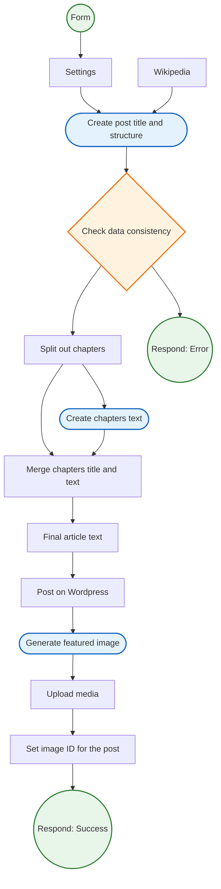

```mermaid
graph TD
    classDef trigger fill:#e8f5e9,stroke:#2e7d32,stroke-width:2px;
    classDef ai fill:#e3f2fd,stroke:#1565c0,stroke-width:2px;
    classDef logic fill:#fff3e0,stroke:#ef6c00,stroke-width:2px;

    Form(("Form")):::trigger
    Settings["Settings"]
    Check_data_consistency{"Check data consistency"}:::logic
    Split_out_chapters["Split out chapters"]
    Merge_chapters_title_and_text["Merge chapters title and text"]
    Final_article_text["Final article text"]
    Post_on_Wordpress["Post on Wordpress"]
    Upload_media["Upload media"]
    Set_image_ID_for_the_post["Set image ID for the post"]
    Respond__Success(("Respond: Success")):::trigger
    Respond__Error(("Respond: Error")):::trigger
    Generate_featured_image(["Generate featured image"]):::ai
    Wikipedia["Wikipedia"]
    Create_post_title_and_structure(["Create post title and structure"]):::ai
    Create_chapters_text(["Create chapters text"]):::ai

    Form --> Settings
    Settings --> Create_post_title_and_structure
    Wikipedia --> Create_post_title_and_structure
    Upload_media --> Set_image_ID_for_the_post
    Post_on_Wordpress --> Generate_featured_image
    Final_article_text --> Post_on_Wordpress
    Split_out_chapters --> Merge_chapters_title_and_text
    Split_out_chapters --> Create_chapters_text
    Create_chapters_text --> Merge_chapters_title_and_text
    Check_data_consistency --> Split_out_chapters
    Check_data_consistency --> Respond__Error
    Generate_featured_image --> Upload_media
    Set_image_ID_for_the_post --> Respond__Success
    Merge_chapters_title_and_text --> Final_article_text
    Create_post_title_and_structure --> Check_data_consistency
```
